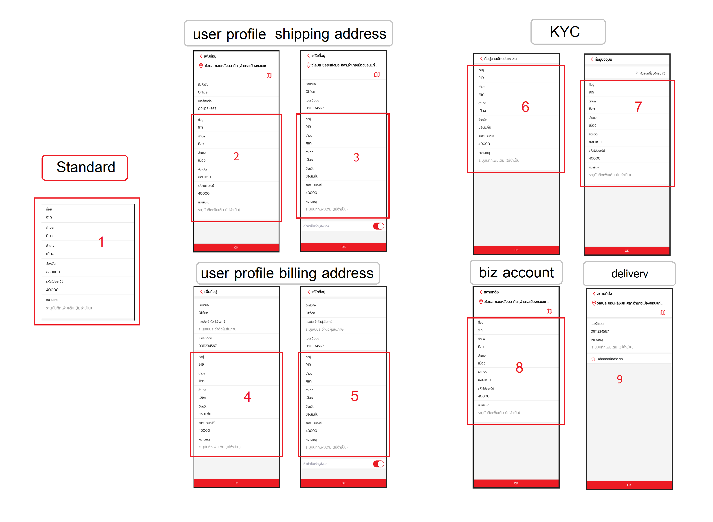
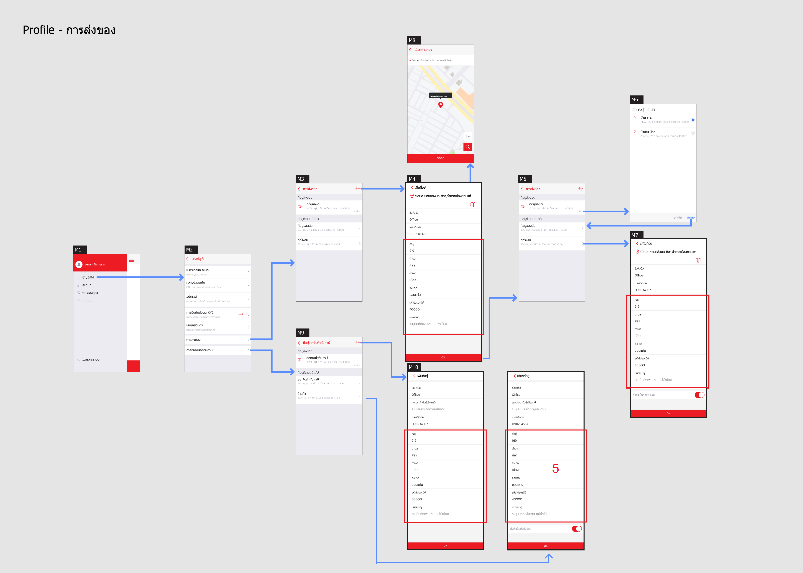
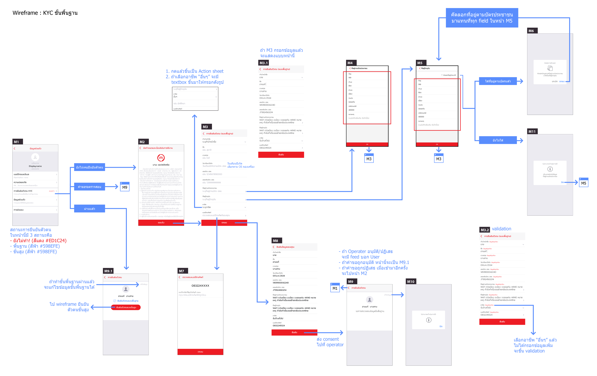
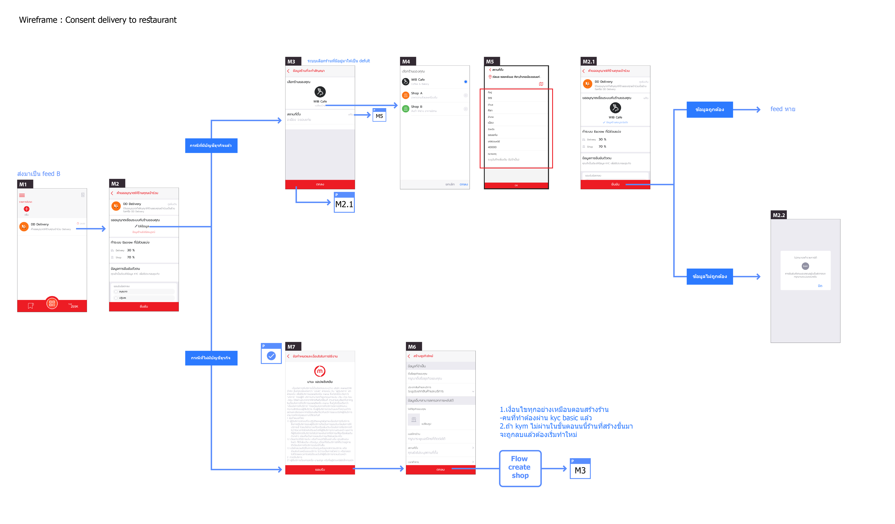
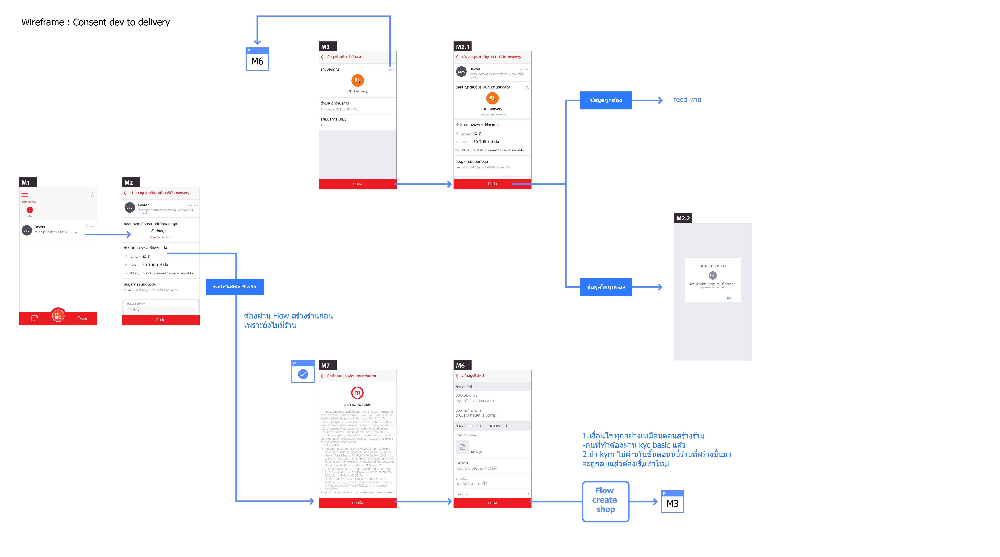
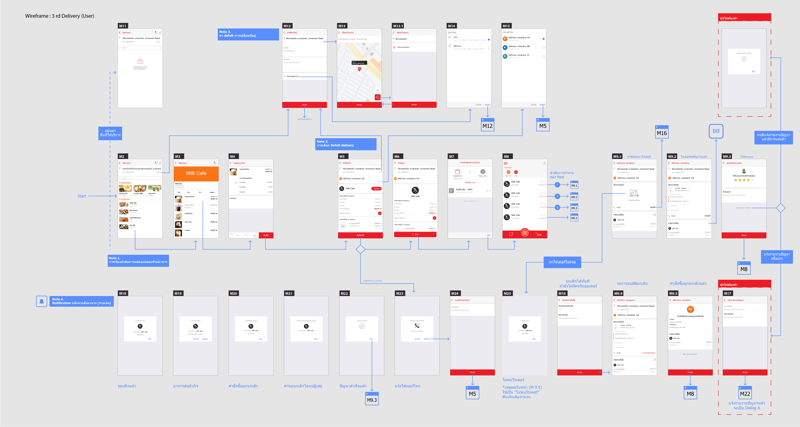

# ========== main model ==========

StandardAddress 📱
- Address: string
- SubDistrict: string
- District: string
- Province: string
- PostalCode: string
- Remark: string

GpsAddress 📱
- Realm: string
- SubDistrict: string
- District: string
- Province: string
- PostalCode: string
- Accuracy: double
- Location: GpsLocation

GpsLocation 📱
- Latitude: double
- Longtitude: double

# ========== page model ==========

ShippingAddress 🖥
- GpsAddress: GpsAddress
- Title: string
- PhoneNumber: string
- Address: StandardAddress
- IsDefault: bool

BillingAddress 🖥
- Title: string
- TaxId: string
- PhoneNumber: string
- Address: StandardAddress
- IsDefault: bool

Kyc (Address) 🖥
- ...
- IdCardAddress: StandardAddress
- CurrentAddress: StandardAddress
- ...

BizAddress 🖥
- GpsAddress: GpsAddress
- Address: StandardAddress

DeliveryAddress  🖥📱
- GpsAddress: GpsAddress
- PhoneNumber: string
- IsVerifiedPhoneNumber: bool ❓(ใครเป็นคนจัดการ ✅server/mobile)❓
- Remark: string

# Issue
address มีอยู่ในทั้ง Shared และ Essentials > ambiguous

# Ref flow image

- demo

- 2 3 4 5 Profile shipping&billing address

- 6 7 kyc

[kyc in GoogleDrive](https://drive.google.com/file/d/1-5DeVXbIaozx26Dbn3sHH-8QLzcV0NY3/view?usp=sharing)

- 8 kym (from biz center)

[Kym in GoogleDrive](https://drive.google.com/drive/u/4/folders/12VOV3uiDhkLnE91Wg9bAs6weAzrJqRAd)

- 8 kym (from consent delivery to restaurant)

[consent delivery to restaurant in GoogleDrive](https://drive.google.com/file/d/1GUjccmwUGBWbQILC_au-hat0ndKL7CPk/view?usp=sharing)

- 8 kym (from consent devster to delivery)

[consent devster to delivery in GoogleDrive](https://drive.google.com/file/d/1c_cRo9txFxn8zhcR9FSBMVOZqT6gY7UJ/view?usp=sharing)

- 9 delivery in mana app

[user delivery in GoogleDrive](https://drive.google.com/file/d/1qEQ1ULg0SAAV6_7EMUhXLqOGXgN2tajh/view?usp=sharing)
