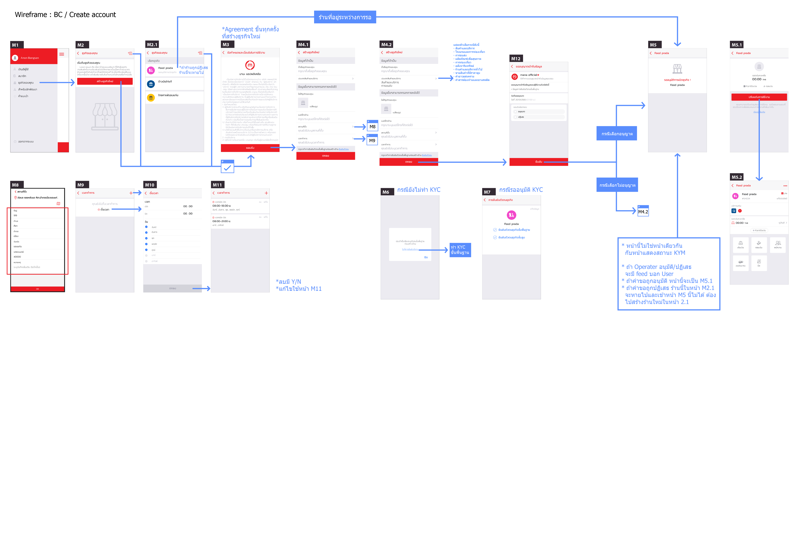

<details>
<summary>OLD</summary>
# ========== main model ==========

StandardAddress 📱
- Address: string
- SubDistrict: string
- District: string
- Province: string
- PostalCode: string
- Remark: string

GpsAddress 📱
- Realm: string
- SubDistrict: string
- District: string
- Province: string
- PostalCode: string
- Accuracy: double
- Location: GpsLocation

GpsLocation 📱
- Latitude: double
- Longtitude: double

# ========== page model ==========

ShippingAddress 🖥
- GpsAddress: GpsAddress
- Title: string
- PhoneNumber: string
- Address: StandardAddress
- IsDefault: bool

BillingAddress 🖥
- Title: string
- TaxId: string
- PhoneNumber: string
- Address: StandardAddress
- IsDefault: bool

Kyc (Address) 🖥
- ...
- IdCardAddress: StandardAddress
- CurrentAddress: StandardAddress
- ...

BizAddress 🖥
- GpsAddress: GpsAddress
- Address: StandardAddress

DeliveryAddress  🖥📱
- GpsAddress: GpsAddress
- PhoneNumber: string
- IsVerifiedPhoneNumber: bool ❓(ใครเป็นคนจัดการ ✅server/mobile)❓
- Remark: string
</details>

# RAW MODELS
```
# AddressBase
Id
AddressType
Name

# StreetAddress : AddressBase, IStreetAddress
Country
Line1
District  ตำบล
City    อำเภอ
Province  จังหวัด
State    รัฐ
PostalCode
Remark

# ContactableAddress : StreetAddress, IHaveContactNo
ContactNo

# BillingAddress : ContactableAddress
TaxId

# ShippingAddress : ContactableAddress, IHaveGpsAddress
GpsAddress

# LocatableAddress : StreetAddress, IHaveGpsAddress (Biz Address)
GpsAddress

# CurrentLocationAddress : StreetAddress, IHaveContactNo, IHaveGpsAddress
GpsAddress

# GpsAddress
GpsLocation
Accuracy: double?

# GpsLocation
Lat
Long

* ประเด็นค้าง
เบอร์โทรถูก verify หรือยังให้ไปทำที่เซิฟเวอร์ + ไปดู scenarios ให้ต่างๆเพื่อออกแบบว่าจริงๆมันควรจะต้องใช้กับเรื่องอะไรบ้าง และจริงๆมันควรจะอยู่ที่ไหน เช่น KYC, KYM, Delivery ฯลฯ
```

# C# MODELS
```c#
namespace TheS.Mana.Essentials
{
    public interface IStreetAddress
    {
        string Country { get; set; }
        string Line1 { get; set; }
        string District { get; set; }
        string City { get; set; }
        string Province { get; set; }
        string State { get; set; }
        string PostalCode { get; set; }
        string Remark { get; set; }
    }

    public abstract class AddressBase
    {
        public string Id { get; set; }
        public string AddressType { get; set; }
        public string Name { get; set; }
    }

    public class StreetAddress : AddressBase, IStreetAddress
    {
        public string Country { get; set; }
        public string Line1 { get; set; }
        public string District { get; set; }
        public string City { get; set; }
        public string Province { get; set; }
        public string State { get; set; }
        public string PostalCode { get; set; }
        public string Remark { get; set; }
    }

    public interface IHaveContactNo
    {
        string ContactNo { get; set; }
    }

    public class ContactableAddress : StreetAddress, IHaveContactNo
    {
        public string ContactNo { get; set; }
    }

    public class BillingAddress : ContactableAddress
    {
        public string TaxId { get; set; }
    }

    public interface IHaveGpsAddress
    {
        GpsAddress GpsAddress { get; set; }
    }

    public class ShippingAddress : ContactableAddress, IHaveGpsAddress
    {
        public GpsAddress GpsAddress { get; set; }
    }

    public class LocatableAddress : StreetAddress, IHaveGpsAddress
    {
        public GpsAddress GpsAddress { get; set; }
    }

    public class CurrentLocationAddress : ContactableAddress, IHaveContactNo
    {
        public GpsAddress GpsAddress { get; set; }
    }

    public class GpsAddress
    {
        public GpsLocation GpsLocation { get; set; }
        public double? Accuracy { get; set; }
    }

    public class GpsLocation
    {
        public double Lat { get; set; }
        public double Long { get; set; }
    }
}
```

# Issue
address มีอยู่ในทั้ง Shared และ Essentials > ambiguous

# Ref flow image

- demo


- 2 3 4 5 Profile shipping&billing address


- 6 7 kyc

[kyc in GoogleDrive](https://drive.google.com/file/d/1-5DeVXbIaozx26Dbn3sHH-8QLzcV0NY3/view?usp=sharing)

- 8 kym (from biz center)

[Kym in GoogleDrive](https://drive.google.com/drive/u/4/folders/12VOV3uiDhkLnE91Wg9bAs6weAzrJqRAd)

- 8 kym (from consent delivery to restaurant)

[consent delivery to restaurant in GoogleDrive](https://drive.google.com/file/d/1GUjccmwUGBWbQILC_au-hat0ndKL7CPk/view?usp=sharing)

- 8 kym (from consent devster to delivery)

[consent devster to delivery in GoogleDrive](https://drive.google.com/file/d/1c_cRo9txFxn8zhcR9FSBMVOZqT6gY7UJ/view?usp=sharing)

- 9 delivery in mana app

[user delivery in GoogleDrive](https://drive.google.com/file/d/1qEQ1ULg0SAAV6_7EMUhXLqOGXgN2tajh/view?usp=sharing)
