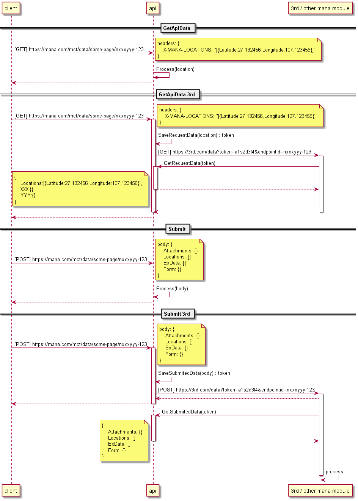

# Mana request body

[DISCUSSION](https://docs.google.com/document/d/1jAtszvDjF5ydBXc6O8SeQkgfbcfaqpamH79FzsYTGx4/edit)

## Topic
- ✅ Mobile data collect
- ✅ Models
- ✅ Mobile and API communications
- ❓ 3rd hook
- ❌ 3rd MContent
- Summary

---

## ✅ Mobile data collect

### Issue pages (address)
- Delivery
    - เลือกร้าน (m2) > 3rd page
    - cart (m5 ในรูปใหม่) (ในรูปเก่าคือ m7) > mana page
    - เปลี่ยนที่อยู่ (m12) > mana page
    - restaurant consent > ที่อยู่ร้าน
    - delivery consent
        - ที่อยู่บริษัท
        - เลือกจุดทำการ
- Profile
    - เพิ่มที่อยู่
    - แก้ไขที่อยู่
    - ออกใบกำกับภาษี
    - KYC ขั้นพื้นฐาน
- BizAccount
    - เพิ่มที่อยู่ ใน สร้าง BA
    - แก้ไขที่อยู่ ใน BC


### Data

```
Locations
Attachments
ExData
Form
```

- Locations

    

    - GPS map page
        - field
            - lat, lon, accuracy, realm
        - form (none)
        - submit (none)
    - GPS section แบบปุ่ม map icon
        - page
            - delivery เปลี่ยนที่อยู่ (m12) > mana page
            - profile
                - เพิ่มที่อยู่
                - แก้ไขที่อยู่
            - BizAccount
                - เพิ่มที่อยู่ ใน สร้าง BA
                - แก้ไขที่อยู่ ใน BC
        - field
            - lat, lon, accuracy, realm
        - form
            - remark, phone
            - address
        - submit / return data
    - GPS section แบบปุ่ม แก้ไข
        - page
            - Delivery
                - เลือกร้าน (m2) > 3rd page
                - cart (m5 ในรูปใหม่) (ในรูปเก่าคือ m7) > mana page
        - field
            - lat, lon, accuracy, realm, address
            - lat, lon, accuracy, realm, remark, phone
        - form (by page)
        - submit only

    

- Attachments
    - AccessInfo (upload file)

- ExData
    - quantity

- Form
    - json body
    
    

### [JS] Data request command
- gps request
    - prepare
        - ตอน register mcontent จะต้องบอกด้วยว่าจะมีการเรียกใช้ gps request mode ไหนบ้างในหน้านี้
        - มี MContentInfo หน้า gps แนบมาด้วยใน N2M
        - เปิดด้วย VM ที่มี gps section และตอน submit จะส่งข้อมูลกลับไปหน้าที่แล้วแทนที่จะ submit ข้อมูลไป server
    - step
        - เปิดหน้าที่มี gps section หรือ map page
        - ส่งข้อมูลไป fill ได้
        - user subbmit return GpsAddress ไปหน้าที่เรียก gps request
    - command
    ```js
    var data: any;
    var mode = "gps"; // gps, delivery, address
    this.svc.gpsRequest(mode, gpsAddress)
        .then((response) => {
            data = response;
        });
    ```
    - page
        - Delivery
            - restaurant consent > ที่อยู่ร้าน
            - delivery consent > ที่อยู่บริษัท
            - delivery consent > เลือกจุดทำการ
    - return nmodel
        - GpsAddress

    

- data request
    - prepare
        - ตอน register mcontent จะต้องบอกด้วยว่าจะมีการเรียกใช้ data request ไปที่ mcontentid ไหนบ้าง เหมือนกับตอนที่ระบุ dialog
        - มี MContentInfo หน้า mcontentid แนบมาด้วยใน N2M
        - เปิดด้วย VM ที่ตอน submit จะส่งข้อมูลกลับไปหน้าที่แล้วแทนที่จะ submit ข้อมูลไป server
    - step
        - เปิดหน้า mcontentid ที่ระบุ
        - ส่งข้อมูลไป fill ได้
        - user subbmit return form ไปหน้าที่เรียก data request
    - command
    ```js
    var data: any;
    var form = { };

    this.svc.dataRequest(target_mcontentid, form)
        .then((response) => {
            data = response;
        });
    ```
    - page 
        - regeistered 3rd form
        - KYC ขั้นพื้นฐาน
    - return nmodel
        - Form: JsonElement
    
    

### Vm & Page


- ข้อเสนอ
    - ยุบรวม page แล้วแสดง gps section ตาม IsVisible & GpsMode
        - MContent1ButtonPage
        - MContentSetLocationPage
    - ยุบรวม vm แล้วเช็คเงื่อนไขการทำงาน gps section จาก MContentInfo.GpsSection
        - MContent1ButtonFormVM
        - MContentSetLocationPageVM
        - MContentAddNewAddressPageVM
        - ChangeShippingAddressVM
        - MContentEditAddressPageVM
    - MContentInfo.GpsSection เพิ่ม property DoSavePhone


## ✅Models


- GpsSection.GpsMode
    - ปัจจุบัน int
    ```
    0: none
    1: single location
    2: dual location
    ```

    - แบบใหม่ int digit
    ```
    0 : none
    1: single location, first is gps mode
    2: single location, first is delivery mode
    3: single location, first is address mode
    11: dual location, first is gps mode, second is gps mode
    12: dual location, first is gps mode, second is delivery mode
    13: dual location, first is gps mode, second is address mode
    21: dual location, first is delivery mode, second is gps mode
    22: dual location, first is delivery mode, second is delivery mode
    23: dual location, first is delivery mode, second is address mode
    31: dual location, first is address mode, second is gps mode
    32: dual location, first is address mode, second is delivery mode
    33: dual location, first is address mode, second is address mode
    111: triple location, first is gps mode, second is gps mode, third is gps mode
    ...
    ```

## ✅Mobile and API communications

### GetDataApi

- ส่ง gps ไปที่ api ผ่าน headers
    - ไม่ส่งผ่าน query string เพราะควรมีการปกปิดข้อมูลนี้
    - รองรับแค่ lat, lon, accuracy
- response model : แล้วแต่ข้อมูลที่ API ส่งกลับมา

### Submit data

- ส่ง gps ไปที่ api ผ่าน headers
    - รองรับแค่ lat, lon, accuracy
- ส่ง gps (รวมถึงข้อมูลอื่นๆ) ไปที่ api ผ่าน ManaRequestBody
    - ไม่ส่งผ่าน query string เพราะควรมีการปกปิดข้อมูลนี้
    - รองรับ lat, lon, remark, phone, address
- response model : ClientResponse

### Location headers

- Get method
    - Request
    ```
    GET https://localhost:44332/api/values/qry
    location1: Latitude=1.111&Longitude=1.111
    location2: Latitude=2.222&Longitude=2.222&Accuracy=11.123
    ```

    - API & Model
    ```c#

    [HttpGet("qry")]
    public IActionResult Query([FromHeader] GeoLocationQry location)
    {
        return Ok();
    }
    public class GeoLocationQry
    {
        public GeoLocation Location1 { get => GetGeoLocation(location1); }
        public GeoLocation Location2 { get => GetGeoLocation(location2); }
        [FromHeader]
        public string location1 { get; set; }
        [FromHeader]
        public string location2 { get; set; }

        private GeoLocation GetGeoLocation(string raw)
        {
            var qry = HttpUtility.ParseQueryString(raw ?? string.Empty);
            var canParse = true;
            canParse = canParse &= double.TryParse(qry.Get("Latitude"), out double Latitude);
            canParse = canParse &= double.TryParse(qry.Get("Longitude"), out double Longitude);
            if (canParse)
            {
                var geoLocation = new GeoLocation
                {
                    Latitude = Latitude,
                    Longitude = Longitude,
                };
                if (double.TryParse(qry.Get("Accuracy"), out double Accuracy))
                {
                    geoLocation.Accuracy = Accuracy;
                }
                return geoLocation;
            }
            else
            {
                return null;
            }
        }
    }
    ```

- pros and cons
    - header สื่อความหมายดี

- Post method

    - Request
    ```
    POST https://localhost:44332/api/values
    location1: Latitude=1.111&Longitude=1.111
    location2: Latitude=2.222&Longitude=2.222&Accuracy=11.123
    content-type: application/json

    {
        "Attachments": "Some file",
        "ExData": {
            "quantity": "1" ,
            "employeeid": "a1s2d3f6g5h4" 
        },
        "Locations": {}
        "Form": {
            "Name":"John"
        }
    }

    ```

    - API & Model
    ```c#
    [HttpPost]
    // public IActionResult Index([FromHeader] GeoLocationQry location, [FromBody] ManaRequestBody<JsonElement, DeliveryLocation> body)
    public IActionResult Index([FromHeader] GeoLocationQry location, [FromBody] ManaRequestBody<SomeForm, DeliveryLocation> body)
    {
        return Ok();
    }
    public class DeliveryLocation : GeoLocation
    {
        public string Remark { get; set; }
        public string PhoneNumber { get; set; }
    }
    public class ManaRequestBody<T, TL>
    {
        public string Attachments { get; set; }
        public IDictionary<string, string> ExData { get; set; }
        public T Form { get; set; }
    }
    public class ManaRequestBody<T, TL> : ManaRequestBody<T>
        where TL : GeoLocation
    {
        public TL[] Locations { get; set; }
    }
    public class SomeForm
    {
        public string Name { get; set; }
    }
    ```

### Issues
- ✅ GeoLocation รอดู design and usage
- AccessInfo key conflict with FQDN
    - workaround >> เอา AccessInfo key (sas) ออกก่อน submit
    - ❓encrypt by base64


## ❓3rd hook
ได้รับลักษณะไหนไหน ให้ส่งต่อแบบเดียวกัน
- http method
    - get
        - รอ response
    - post
        - รอ response
            - cart hook
            - checkout hook
        - ไม่รอ response
            - add product hook
            - submit form hook
        - ไม่รอ response + track status
            - payment hook



## ❌3rd MContent
- MContent ส่ง gps ไปด้วย
- MContent ส่ง endpoint id ไปด้วย


## Summary
- ควรทำหลังจาก playground แบบเดิมๆ ใช้งานได้แล้ว
- งานที่ต้องทำ
    - ปรับ model
        - ManaRequestBody
        - GpsSection
        - MContentInfo.GpsMode
    - ปรับการรับส่งข้อมูล
        - location header
        - quantity
        - store phone
    - feature ใหม่
        - GpsRequest
        - DataRequest
    - ข้อเสนอปรับ Page&VM
    - ❓3rd hook

- teams ที่เกี่ยวข้อง
    - mobile
    - jslib
    - playground
    - server srcx
    - server src
