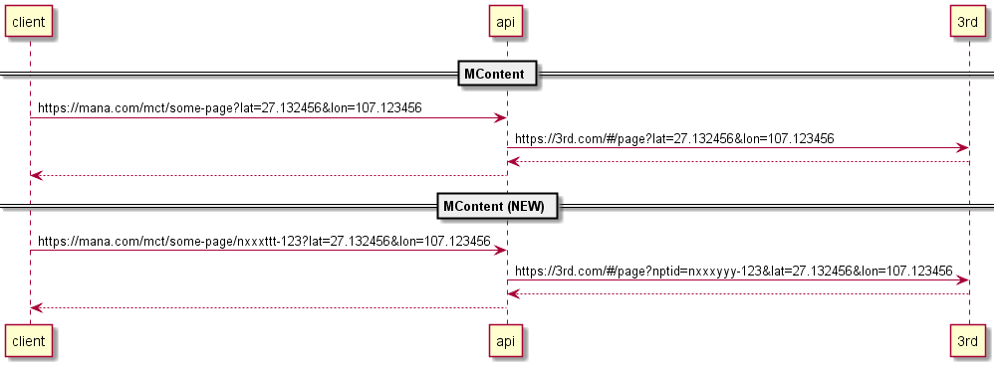

# Mana request body

## Models

## Data transforms

### Main ideas
- GetDataApi ส่ง gps ไปที่ api ผ่าน query string
- Submit data ส่ง gps ไปที่ api ผ่าน ManaRequestBody

- 3rd รับ gps ผ่าน query string เท่านั้น จะได้ไม่สับสน
- 3rd รับ Attachments ผ่าน headers
- 3rd รับ ExData ผ่าน headers
- 3rd รับ Form ผ่าน body

### Issues
- AccessInfo key conflict with FQDN
    - workaround >> เอา AccessInfo key (sas) ออกก่อน submit
- [LOW] Hook data lost

### Extra ideas >> ได้ใช้รึเปล่า
- MContent ส่ง gps ไปด้วย
- MContent ส่ง endpoint id ไปด้วย

