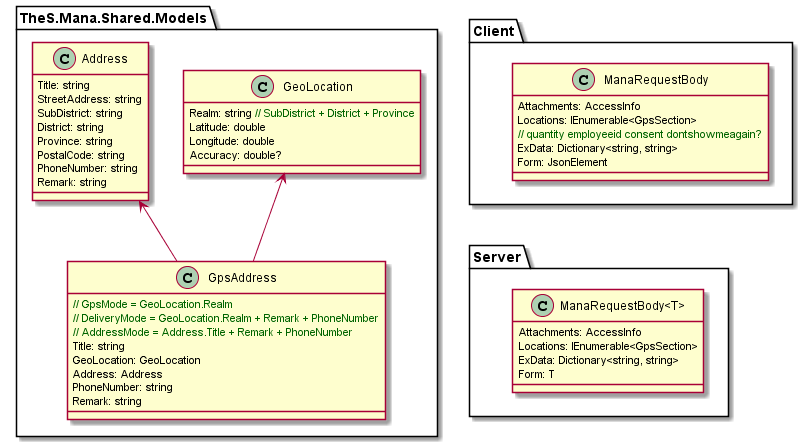
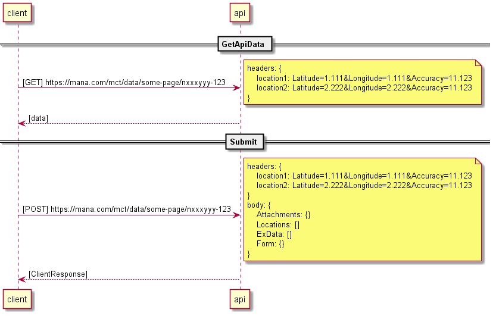
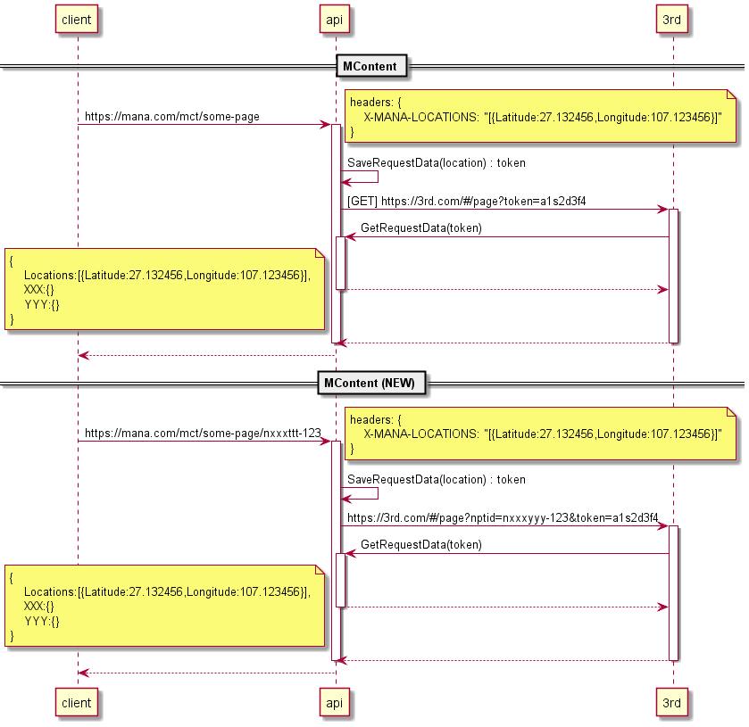

# Mana request body
## Topic
- ✅Mobile data collect
- ✅Models
- ✅Mobile and API communications
- ❓3rd hook
- ❌3rd MContent

---

## ✅Mobile data collect

### Locations
- ✅ GPS section แบบปุ่ม map icon
    - page
        - delivery เปลี่ยนที่อยู่ (m12) > mana page
        - profile เพิ่ม/แก้ไข ที่อยู่
        - BizAccount แก้ไข ที่อยู่
    - field
        - lat
        - lon
- ✅ GPS section แบบปุ่ม แก้ไข
    - page
        - delivery เลือกร้าน (m2) > 3rd page
        - delivery cart (m7) > mana page
    - field
        - lat
        - lon
        - remark
        - phone
- ❌ Address แบบปุ่ม แก้ไข จาก html
    - page
        - restaurant consent
    - แก้ไขที่อยู่แล้วข้อมูล fill ใน form > ไม่เกี่ยวกับส่วน GPS section ที่จะส่งผ่าน header
- ❌ GPS แบบกดเลือกจาก html
    - page
        - delivery consent
    - เลือกปักหมุดแล้วข้อมูล fill ใน form > ไม่เกี่ยวกับส่วน GPS section ที่จะส่งผ่าน header
- ❓ ในอนาคต
    - logistic
    - support address field

### Attachments
- AccessInfo

### ExData
- quantity

### Form

## ✅Models

## ✅Mobile and API communications
- GetDataApi
    - ส่ง gps ไปที่ api ผ่าน headers
        - ไม่ส่งผ่าน query string เพราะควรมีการปกปิดข้อมูลนี้
    - รองรับแค่ lat, lon
    - response model : แล้วแต่ข้อมูลที่ API ส่งกลับมา
- Submit data
    - ส่ง gps (รวมถึงข้อมูลอื่นๆ) ไปที่ api ผ่าน ManaRequestBody
        - ไม่ส่งผ่าน query string เพราะควรมีการปกปิดข้อมูลนี้
        - ไม่ส่งผ่าน header
            - จะต้องส่ง remark, phone, address ด้วย เพื่อเลี่ยง header maximum length
            - ถ้าต้องส่ง gps ผ่าน header แล้วส่ง remark, phone, address ผ่าน body > จะต้องมีขั้นตอนการ mapping เพิ่ม
        - ❓ ส่ง gps ผ่านทั้ง header และ body
    - รองรับ lat, lon, remark, phone
        - ในอนาคตรองรับ address
    - response model : ClientResponse

### Issues
- GeoLocation รอดู design and usage
- AccessInfo key conflict with FQDN
    - workaround >> เอา AccessInfo key (sas) ออกก่อน submit
    - ❓encrypt by base64

## ❓3rd hook

- get
    - รอ response
- post
    - รอ response
        - cart hook
        - checkout hook
    - ไม่รอ response
        - add product hook
        - submit form hook
    - ไม่รอ response + track status
        - payment hook
- 

## ❌3rd MContent
- MContent ส่ง gps ไปด้วย
- MContent ส่ง endpoint id ไปด้วย

