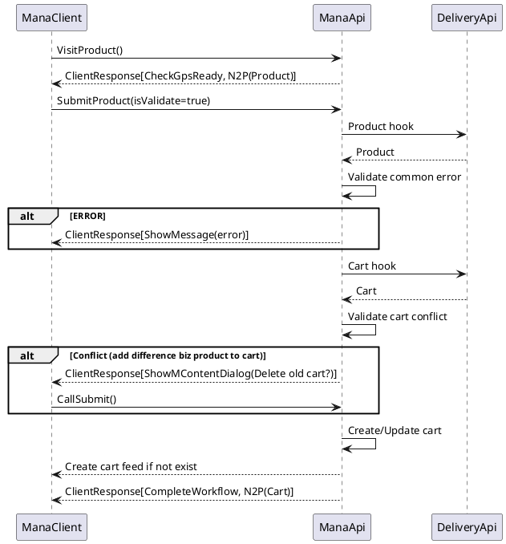
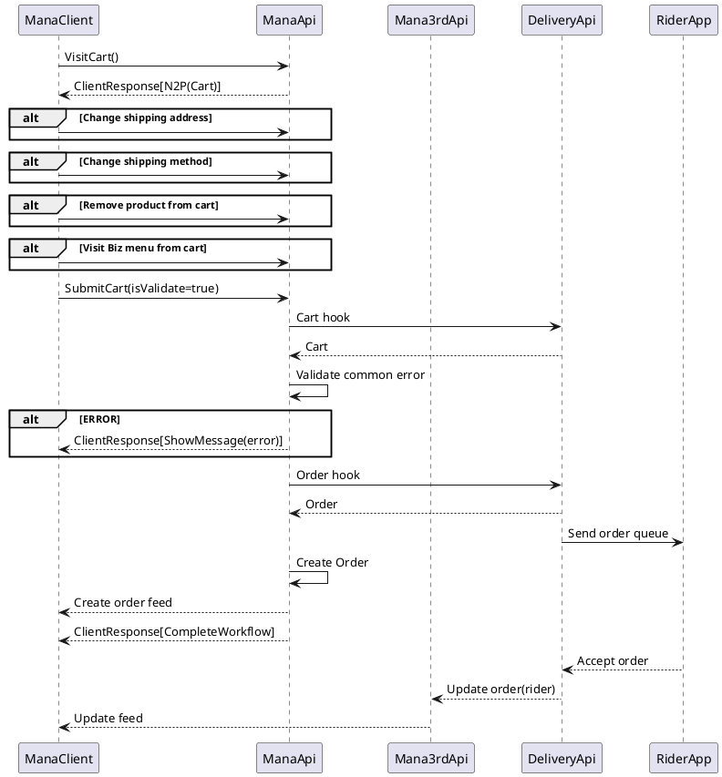

# Add product

```plantuml
@startuml

ManaClient -> ManaApi : VisitProduct()
ManaClient <-- ManaApi : ClientResponse[CheckGpsReady, N2P(Product)]
ManaClient -> ManaApi : SubmitProduct(isValidate=true)
ManaApi -> DeliveryApi : Product hook
ManaApi <-- DeliveryApi : Product
ManaApi -> ManaApi : Validate common error
alt ERROR
    ManaClient <-- ManaApi : ClientResponse[ShowMessage(error)]
end
ManaApi -> DeliveryApi : Cart hook
ManaApi <-- DeliveryApi : Cart
ManaApi -> ManaApi : Validate cart conflict
alt Conflict (add difference biz product to cart)
    ManaClient <-- ManaApi : ClientResponse[ShowMContentDialog(Delete old cart?)]
    ManaClient -> ManaApi : CallSubmit()
end
ManaApi -> ManaApi : Create/Update cart
ManaClient <-- ManaApi : Create cart feed if not exist
ManaClient <-- ManaApi : ClientResponse[CompleteWorkflow, N2P(Cart)]

@enduml
```

# Pay cart

```plantuml
@startuml

participant ManaClient
participant ManaApi
participant Mana3rdApi
participant DeliveryApi
participant RiderApp

ManaClient -> ManaApi : VisitCart()
ManaClient <-- ManaApi : ClientResponse[N2P(Cart)]
alt Change shipping address
    ManaClient -> ManaApi
end
alt Change shipping method
    ManaClient -> ManaApi
end
alt Remove product from cart
    ManaClient -> ManaApi
end
alt Visit Biz menu from cart
    ManaClient -> ManaApi
end
ManaClient -> ManaApi : SubmitCart(isValidate=true)
ManaApi -> DeliveryApi : Cart hook
ManaApi <-- DeliveryApi : Cart
ManaApi -> ManaApi : Validate common error
alt ERROR
    ManaClient <-- ManaApi : ClientResponse[ShowMessage(error)]
end
ManaApi -> DeliveryApi : Order hook
ManaApi <-- DeliveryApi : Order
DeliveryApi -> RiderApp : Send order queue
ManaApi -> ManaApi : Create Order
ManaClient <-- ManaApi : Create order feed
ManaClient <-- ManaApi : ClientResponse[CompleteWorkflow]
DeliveryApi <-- RiderApp : Accept order
Mana3rdApi <-- DeliveryApi : Update order(rider)
ManaClient <-- Mana3rdApi : Update feed

@enduml
```