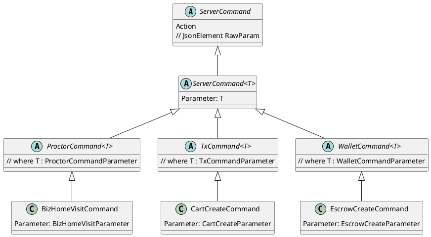
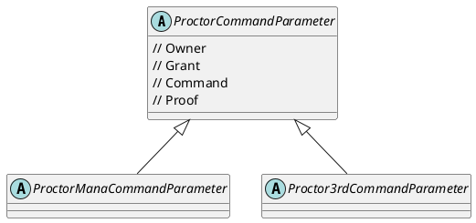
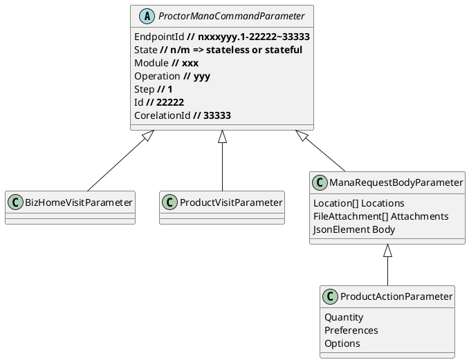
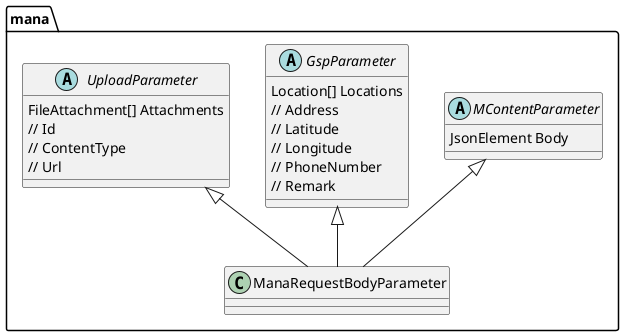
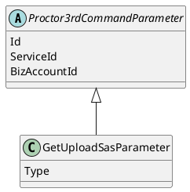
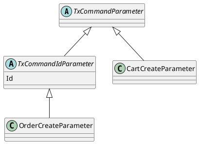
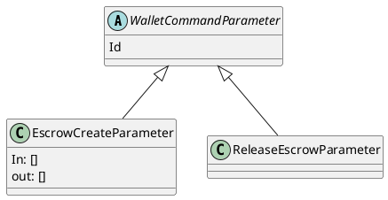

# class diagram
- ตั้งค่า Visual code Settings
    - Plantuml: Server = https://plantuml.com/plantuml

## Server Command
มี base class ใหญ่คือ ServerCommand แตกออกเป็น 3 สายตามโครงสร้าง
- ProctorCommand<T>
    - ใช้ ProctorCommandParameter เป็น parameter
- TxCommand<T>
    - ใช้ TxCommandParameter เป็น parameter
- WalletCommand<T>
    - ใช้ WalletCommandParameter เป็น parameter


### ตัวอย่าง Command ต่างๆ
<details>
<summary>ProctorCommand</summary>
<pre>
- BizHomeVisitCommand
- ProductVisitCommand  
- ProductActionCommand
- DeliveryMethodChangeCommand
- LocationChangeCommand
- OrderCheckoutCommand
- ReminderCreateCommand
- ReminderUpdateCommand
- EscrowReleaseCommand
- ReminderEndCommand
- . . .
</pre>
</details>
<details>
<summary>TxCommand</summary>
<pre>
- CartCreateCommand
- OrderCreateCommand
- ProductAddCommand
- DeliveryMethodChangeCommand
- LocationChangeCommand
- OrderCheckoutCommand
- OrderCancelCommand
- PromptpayDepositStartCommand
- PromptpayDepositEndCommand
- PromptpayWithdrawStartCommand
- . . .
</pre>
</details>
<details>
<summary>WalletCommand</summary>
<pre>
- EscrowCreateCommand
- EscrowCreateCommand
- TransferCommand
- EscrowCancelCommand
- WalletDepositCommand
- WalletWithdrawCommand
- WalletPaymentCommand
- DevCreateCommand
- BACreateCommand
- BADeliveryCreateCommand
- BudgetCreateCommand
- . . .
</pre>
</details>

## Proctor Command Parameter
Parameter ของ Proctor จะมีเรื่อง grant และแบ่งเป็น parameter จากฝั่ง mana app และ 3rd party


### Proctor Mana Command Parameter
parameter ฝั่ง mana app จะทำงานกับ endpoint เป็นหลัก


### Mana Request Body Parameter (optional)
ManaRequestBodyParameter อาจจะ implement มาจาก abstract แต่ละเรื่อง



### Proctor 3rd Command Parameter
parameter ฝั่ง 3rd party จะทำงานกับ id เป็นหลัก และระบุว่า service / biz ไหน



## Tx Command Parameter
ทำงานกับ id ที่มาจาก endpoint เป็นหลัก หรืออาจจะมีบาง command ที่ไม่ต้องมี id เพราะรู้จาก context อยู่แล้ว เช่น personalAccountId



## Wallet Command Parameter
ทำงานกับ id ของ wallet/escrow เป็นหลัก



# Models

```csharp
    abstract class ServerCommand
    {
        public string Action { get; set; }
        // JsonElement RawParam
    }

    abstract class ServerCommand<T> : ServerCommand
    {
        public T Parameter { get; set; }
    }

    abstract class ProctorCommand<T> : ServerCommand<T> where T : ProctorCommandParameter { }
    abstract class TxCommand<T> : ServerCommand<T> where T : TxCommandParameter { }
    abstract class WalletCommand<T> : ServerCommand<T> where T : WalletCommandParameter { }

    abstract class ServerCommandParameter
    {
        public string Owner { get; set; }
        public string Grant { get; set; }
        public string Command { get; set; }
        public string Proof { get; set; }
    }
    abstract class ProctorCommandParameter : ServerCommandParameter
    {
        public string EndpointId { get; set; }

        public string State { get; }
        public string Module { get; }
        public string Operation { get; }
        public string Step { get; }
        public string Id { get; }
        public string CorelationId { get; }
    }
    abstract class TxCommandParameter : ServerCommandParameter { }
    abstract class TxCommandIdParameter : TxCommandParameter
    {
        public string Id { get; set; }
    }
    abstract class WalletCommandParameter : ServerCommandParameter { }
    abstract class WalletCommandIdParameter : WalletCommandParameter
    {
        public string Id { get; set; }
    }

    class CartCreateCommand : TxCommand<CartCreateParameter> { }
    class CartCreateParameter : TxCommandParameter { }
```