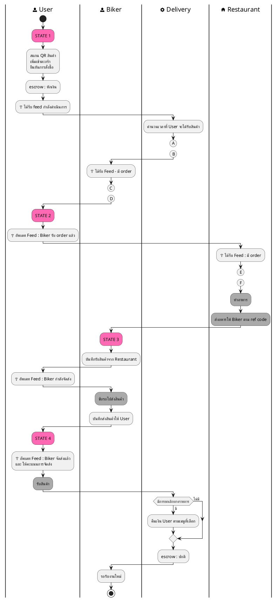
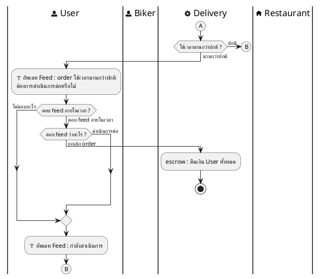
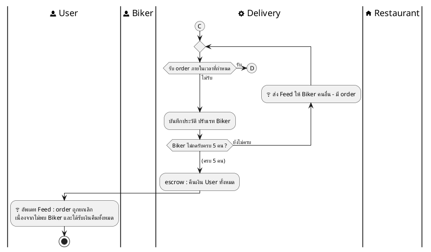
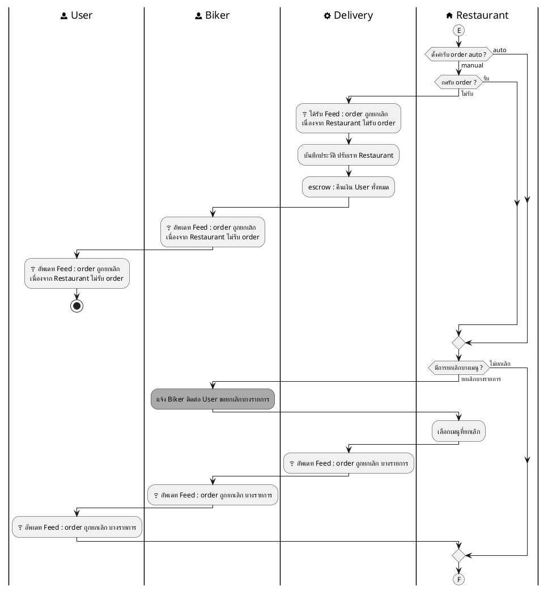
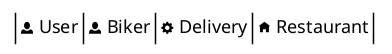

# Normal case sequence

```plantuml
@startuml
|<&person> User|
|<&person> Biker|
|<&cog> Delivery|
|<&home> Restaurant|

|<&person> User|
start
#HotPink:STATE 1;
:สแกน QR สินค้า
เพิ่มเข้าตะกร้า
ยืนยันการสั่งซื้อ;
:escrow : หักเงิน;
:<&wifi> ได้รับ feed กำลังดำเนินการ;
|<&cog> Delivery|
:คำนวนเวลาที่ User จะได้รับสินค้า;
(A)
detach
(B)
|<&person> Biker|
:<&wifi> ได้รับ Feed - มี order;
(C)
detach
(D)
|<&person> User|

#HotPink:STATE 2;
:<&wifi> อัพเดท Feed : Biker รับ order แล้ว;
|<&home> Restaurant|
:<&wifi> ได้รับ Feed : มี order;
|<&home> Restaurant|
(E)
detach
(F)
|<&home> Restaurant|
#AAAAAA:ทำอาหาร;
#AAAAAA:ส่งอหารให้ Biker ตาม ref code;

|<&person> Biker|
#HotPink:STATE 3;
:บันทึกรับสินค้าจาก Restaurant;
|<&person> User|
:<&wifi> อัพเดท Feed : Biker กำลังจัดส่ง;
|<&person> Biker|
#AAAAAA:ขับรถไปส่งสินค้า;
:บันทึกส่งสินค้าให้ User;
|<&person> User|

#HotPink:STATE 4;
:<&wifi> อัพเดท Feed : Biker จัดส่งแล้ว
และ ให้คะแนนการจัดส่ง;
#AAAAAA:รับสินค้า;
|<&cog> Delivery|
if (มีการยกเลิกบางรายการ) then (มี)
  :คืนเงิน User ตามเมนูที่เลือก;
else (ไม่มี)
endif
:escrow : ปกติ;
|<&person> Biker|
:รอรับงานใหม่;
stop
@enduml
```

(A) (B) order ใช้เวลานานกว่าปกติ

```plantuml
@startuml
|<&person> User|
|<&person> Biker|
|<&cog> Delivery|
|<&home> Restaurant|

|<&cog> Delivery|
(A)
if (ใช้เวลานานกว่าปกติ ?) then (นานกว่าปกติ)
else (ปกติ)
  (B)
endif
|<&person> User|
:<&wifi> อัพเดท Feed : order ใช้เวลานานกว่าปกติ
ต้องการดำเนินการต่อหรือไม่;
if (ตอบ feed ภายในเวลา ?) then (ไม่ตอบอะไร)
  |<&person> User|
else (ตอบ feed ภายในเวลา)
  if (ตอบ feed ว่าอะไร ?) then (ดำเนินการต่อ)
  |<&person> User|
  else (ยกเลิก order)
    |<&cog> Delivery|
    :escrow : คืนเงิน User ทั้งหมด;
    stop
  endif
endif
|<&person> User|
:<&wifi> อัพเดท Feed : กำลังดำเนินการ;
(B)
@enduml
```

(C) (D) หา Biker รับงาน

```plantuml
@startuml
|<&person> User|
|<&person> Biker|
|<&cog> Delivery|
|<&home> Restaurant|

|<&cog> Delivery|
(C)
repeat
if (รับ order ภายในเวลาที่กำหนด) then (ไม่รับ)
else (รับ)
  (D)
endif
:บันทึกประวัติ ปรับเรท Biker;
backward:<&wifi> ส่ง Feed ให้ Biker คนอื่น - มี order;
repeat while (Biker ไม่กดรับครบ 5 คน ?) is (ยังไม่ครบ)
-> (ครบ 5 คน);
:escrow : คืนเงิน User ทั้งหมด;
|<&person> User|
:<&wifi> อัพเดท Feed : order ถูกยกเลิก
เนื่องจากไม่พบ Biker และได้รับเงินคืนทั้งหมด;
stop
@enduml
```

(E) (F) ยกเลิกบางเมนู

```plantuml
@startuml
|<&person> User|
|<&person> Biker|
|<&cog> Delivery|
|<&home> Restaurant|

(E)
if (ตั้งค่ารับ order auto ?) then (auto)
else(manual)
  if (กดรับ order ?) then (ไม่รับ)
    |<&cog> Delivery|
    :<&wifi> ได้รับ Feed : order ถูกยกเลิก
    เนื่องจาก Restaurant ไม่รับ order;
    :บันทึกประวัติ ปรับเรท Restaurant;
    :escrow : คืนเงิน User ทั้งหมด;
    |<&person> Biker|
    :<&wifi> อัพเดท Feed : order ถูกยกเลิก
    เนื่องจาก Restaurant ไม่รับ order;
    |<&person> User|
    :<&wifi> อัพเดท Feed : order ถูกยกเลิก
    เนื่องจาก Restaurant ไม่รับ order;
    stop
  else (รับ)
  endif
endif
|<&home> Restaurant|
if (มีการยกเลิกบางเมนู ?) then (ยกเลิกบางรายการ)
|<&person> Biker|
#AAAAAA:แจ้ง Biker ติดต่อ User ขอยกเลิกบางรายการ;
|<&home> Restaurant|
:เลือกเมนูที่ยกเลิก;
|<&cog> Delivery|
:<&wifi> อัพเดท Feed : order ถูกยกเลิก บางรายการ;
|<&person> Biker|
:<&wifi> อัพเดท Feed : order ถูกยกเลิก บางรายการ;
|<&person> User|
:<&wifi> อัพเดท Feed : order ถูกยกเลิก บางรายการ;
else (ไม่ยกเลิก)
endif
|<&home> Restaurant|
(F)
@enduml
```

# Exception case sequence

Other

```plantuml
@startuml
|<&person> User|
|<&person> Biker|
|<&cog> Delivery|
|<&home> Restaurant|

@enduml
```

