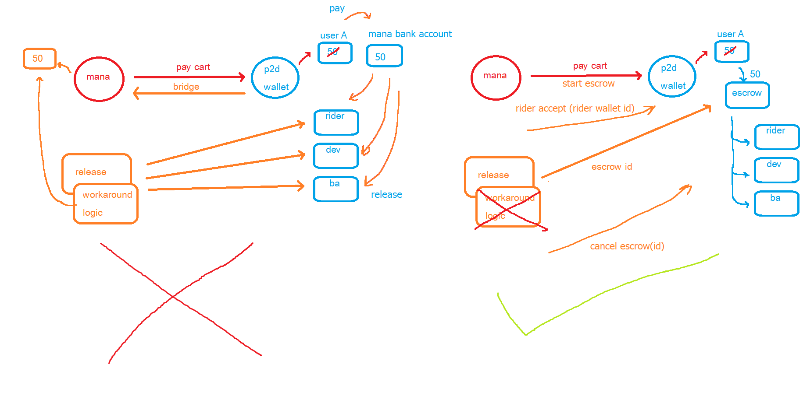

# SUMMARY

หัวข้อคร่าวๆ

- STEP 1 delivery ใช้งานได้
    1. การย้าย wallet
    2. delivery ใช้เงินจริง แบบ escrow อย่างง่ายสุด
        1. ตัวอย่าง command & params เรื่อง escrow ใน ICommonWalletService
        2. รายละเอียดของ command & params
        3. ประเมินเวลาที่ใช้
        4. ถอนเงินจากร้าน
- STEP 2 โฟลวที่มีอยู่แล้ว ใช้เงินจริง ให้ครบ
- STEP 3 ตะกร้า จริงจัง
- STEP 4 delivery ใช้ contract มี escrow จริงจัง

# STEP 1 delivery ใช้งานได้

## 1. การย้าย wallet
1. ❓ เช็คตอน เติมถอน ถ้ากระเป๋าจริงเพิ่มลดเงินตาม log แล้ว จะไม่การรีเซตข้อมูลใหม่ก็ได้
2. เปลี่ยนจาก getBalance ให้ไปดึงค่าจาก กระเป๋าจริง
    - ICommonWalletService.GetBalance(walletId: string): MonetaryValue
3. ปิดเมนูที่ใช้ กระเป๋าdb ก่อน
    - adhoc

## 2. delivery ใช้เงินจริง แบบ escrow อย่างง่ายสุด

จากที่คุยกันมาแนวทางที่ใช้จะเป็นการใช้เงินจริง และใช้ escrow อย่างง่าย ตามรูปด้านขวา

### ตัวอย่าง command & params เรื่อง escrow ใน ICommonWalletService

จะมี command สั่งไปที่ กระเป๋าเงินจริง 4 commands ดังนี้

- StartEscrow(walletId, baId, amountIn, outs[]): StartTxResultBase
    - outs > { walletId, amount, refId, contractId }
    - StartTxResultBase > { IsSucceeded, Message, TxId }
- UpdateEscrow(txId, RefId, WalletId): MonetaryBase
    - MonetaryBase > { IsSucceeded, Message }
- ReleaseEscrow(txId): MonetaryBase
- CancelEscrow(txId): MonetaryBase

### รายละเอียดของ command & params

1. user กดจ่ายตะกร้า จะ StartEscrow มี params ดังนี้
    - walletId: กระเป๋าคนจ่าย
    - baId: ร้านที่ซื้อของ
    - amountIn: เงินที่จ่ายทั้งหมด
    - outs[]: รายการ รายละเอียดที่จะกระจายเงิน ประกอบด้วย
        - walletId: ที่จะรับ (ว่างไว้ก่อนได้ กรณีรอไรเดอร์รับงาน)
        - amount: ที่จะรับ
        - refId: อ้างอิงเอาไว้อัพเดท
        *** note เคส delivery ปัจจุบันจะแจกเงินไป 4 รายการแน่ๆดังนี้ restaurant, delivery, rider, developer ตามอัตราส่วนที่ระบุใน contract ที่ consent ไป
2. ไรเดอร์รับงาน จะ UpdateEscrow มี params ดังนี้
    - txId: ที่ได้จากการ StartEscrow
    - outUpdates[]: รายการ รายละเอียดที่จะกระจายเงิน ที่ต้องการจะเปลี่ยน ประกอบด้วย
        - refId: ที่จะเปลี่ยน
        - WalletId: ที่จะรับเงินก้อนนี้
        *** note เปลี่ยนจำนวนเงินไม่ได้ ตาม contract ที่ได้คำนวณตอนกดจ่ายเงิน
3. rider กดปิดส่งของ จะ ReleaseEscrow แล้วกระจายเงินตามรายละเอียด 2.1-2.2
4. CancelEscrow ยกเลิก escrow > ให้ support แค่เคสคืนเงินทั้งหมดก่อน
### ประเมินเวลาที่ใช้
1. คุยตกลง ปรับ format params ~1.5 วัน
2. ปรับให้ mana เรียกใช้ command ตามจุดต่างๆ ~1 วัน
3. ทดสอบว่าเรียกใช้งานได้ถูกต้อง ~1 วัน
4. ส่วนของเงินจริง

*** โดยรวมภายในอาทิตย์นี้ 3.1-3.3 น่าจะเสร็จ

### ถอนเงินจากร้าน

# STEP 2 โฟลวที่มีอยู่แล้ว ใช้เงินจริง ให้ครบ
1. QR format
    1. ppay external
    2. topup qr
    3. topup bank account > ใช้โฟลวเหมือน topup qr
    4. deposit bank account
2. adhoc
3. ถอนเงินจากร้าน

# STEP 3 ตะกร้า จริงจัง
# STEP 4 delivery ใช้ contract มี escrow จริงจัง
