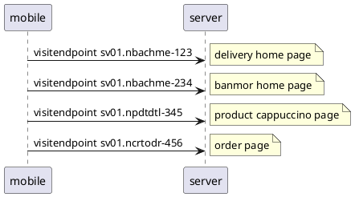
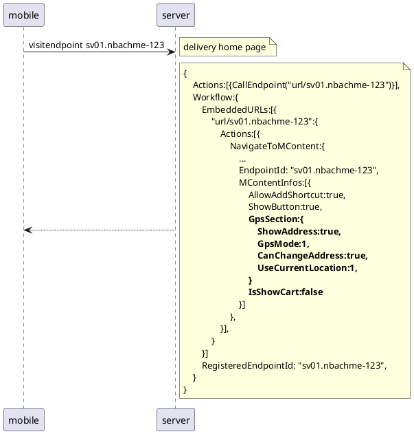
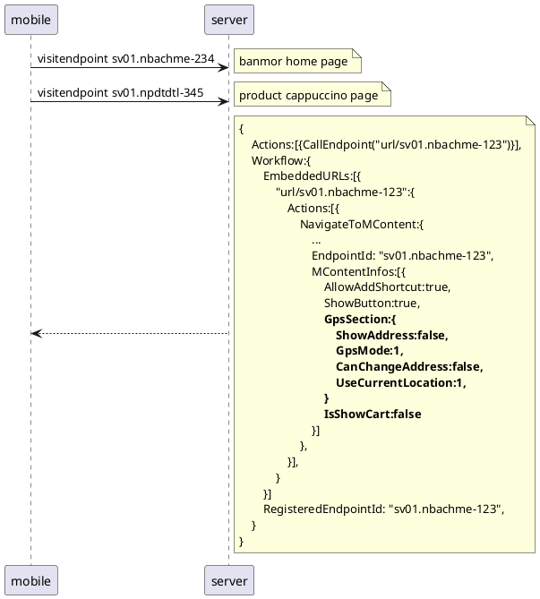
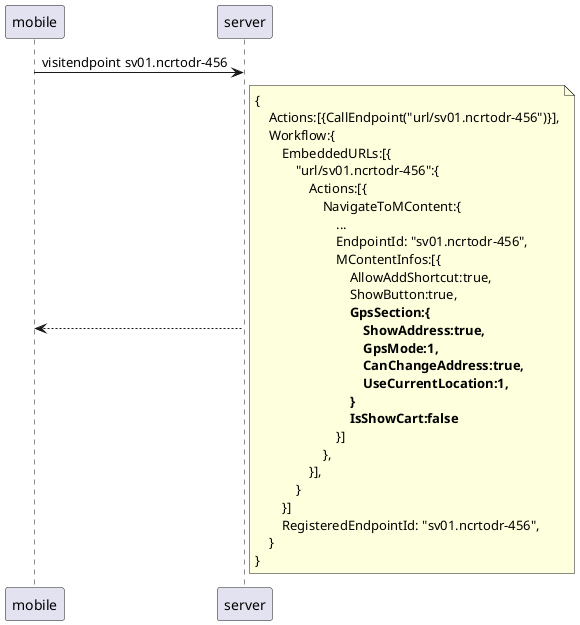
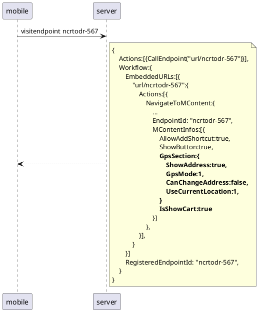

# visit endpoint


# show gps


# hide gps


# order (หลัง add to cart / กดจาก feed ยังไม่ checkout )


# from feed (checkout แล้ว)


------------------------------
# Submit GPS

```c#
/// <summary>
/// The Mana info request body
/// </summary>
public class ManaRequestBody
{
    /// <summary>
    /// The id, url value pairs for the attachments
    /// </summary>
    public IEnumerable<FileAttachment> Attachments { get; set; }
    public IEnumerable<GpsLocation> Locations { get; set; }
    public JsonElement Form { get; set; }
}

/// <summary>
/// The request body with quantity
/// </summary>
/// <example>Use with add product to cart</example>
public class ManaRequestBodyWithQuantity : ManaRequestBody
{
    /// <summary>
    /// (Optional) The quantity, if specified
    /// </summary>
    public int Quantity { get; set; }
}

public class FileAttachment
{
    public string Id { get; set; }
    public string ContentType { get; set; }
    public string Url { get; set; }
}

public class GpsLocation
{
    public string Address { get; set; } // full address string or location title from map
    public string Latitude { get; set; }
    public string Longitude { get; set; }
    public string PhoneNumber { get; set; }
    public string Remark { get; set; }
}
```

# Address db model
```csharp
public class UserAddress
{
    public string _id { get; set; }
    public string PaId { get; set; }
    public int? BillingAddressIndex { get; set; }        
    public int? ShippingAddressIndex { get; set; }
    public DateTime CreatedDate { get; set; }
}

public class Address
{
    public string _id { get; set; }
    public string PaId { get; set; }
    public string Title { get; set; }
    public string StreetAddress { get; set; }
    public string District { get; set; }
    public string City { get; set; }
    public string Province { get; set; }
    public string PostalCode { get; set; }
    public string TelephoneNumber { get; set; }
    public string MobileNumber { get; set; }
    public GpsLocation Location { get; set; }
    public DateTime CreatedDate { get; set; }
}

public class GpsLocation
{
    public double Latitude { get; set; }
    public double Longitude { get; set; }
}
```