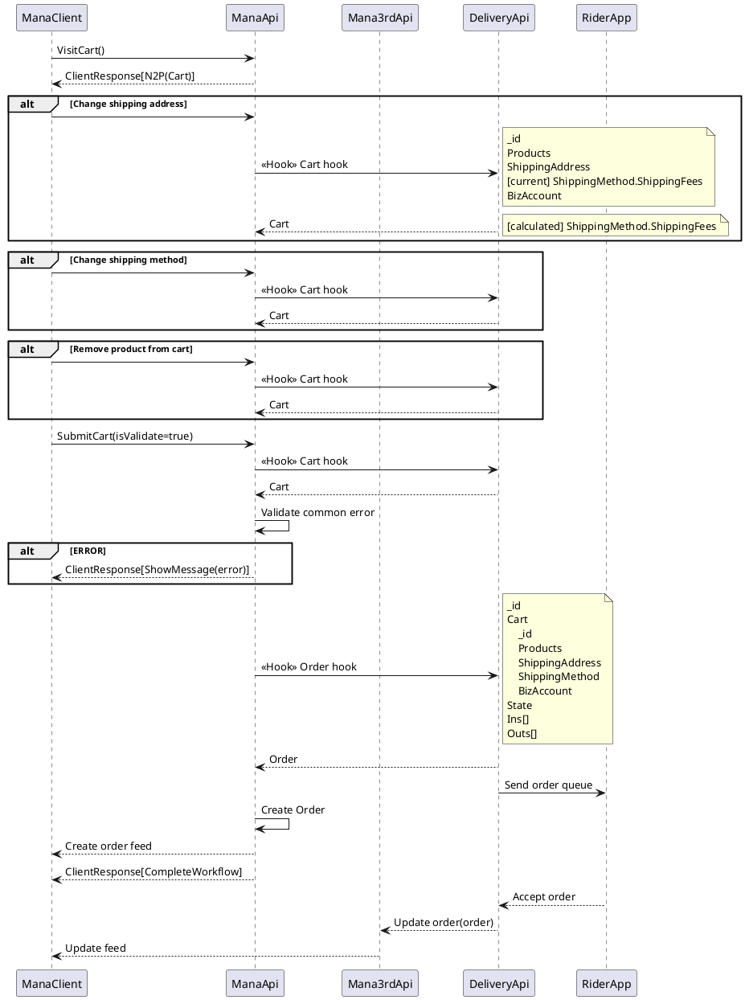

# ค่าส่งตามระยะทาง

✅ = ปัจจุบันเป็นแบบนี้  
⌛ = ของที่จะทำเพิ่ม  
❗ = ของที่จะยังไม่ทำ  

## Concepts

- ปรับตอนทำสัญญา ให้รองรับการคำนวณ ค่าส่งตามระยะทาง
    - ถามทีม run delivery ใช้ค่า max ?
- ปรับ cart hook ให้รับค่าส่งที่คำนวณมาจาก 3rd
- ปรับ order hook ตอนคำนวณเงิน Ins, Outs จากสัญญาใหม่

## ตอนทำสัญญา

- DeliveryContract (delivery : Restaurant)
    - ✅ ServiceShare
    - ✅ RiderShare
    - ⌛ เพิ่ม field เอาไว้เช็คว่าตอนกระจายเงิน ถ้าเกินเงินที่ user จายเข้ามา ให้ไปดึงจาก budget (ปัจจุบันคือดึงกระเป๋าร้าน delivery โดยตรง)
        - DoNotSubsidizeFromBudget < ใช้ชื่อนี้ เพราะถ้า default: false จะเข้ากับเคสปัจจุบันที่ดึงเงินส่วนเกินจาก delivery ไปให้ rider
        - SubsidizeFromBudget < ควรจะชื่อนี้ แต่ถ้า default: false มันจะทำให้เคสปัจจุบันจ่ายเงิน rider ไม่เต็ม

- ShippingContract (devster : delivery)
    - ✅ ShippingAmountUnit
    - ✅ ShareValue (GP)
    - ⌛ เพิ่ม field MaxShippingAmountUnit
    - ⌛ เพิ่ม field เอาไว้คำนวณว่าตอนกระจายเงิน ส่วนต่างค่าส่งจะเอาให้ใคร
        - ShippingFeeSurplusIncludeTo > Restaurant, Developer, Rider, Delivery
             - Default : Delivery

## ตอนคำนวณ

- Cart hook ส่งตะกร้าให้ 3rd
    - ✅ จุดที่ hook
        - เปลี่ยนที่อยู่จัดส่ง
        - เปลี่ยนเจ้า delivery
        - ❗ แก้ไขสินค้า
        - ลบสินค้าจากตะกร้า
        - เพิ่มสินค้าเข้าตะกร้า
    - ✅ ShippingFees
        - เพิ่มสินค้าเข้าตะกร้าครั้งแรก > mana จะส่งค่า ShippingAmountUnit จากใน Contract ไป (ค่าส่งขึ้นต้น)
        - Cart hook อื่นๆ > ส่ง ShippingMethod.ShippingFees ปัจจุบันไป
    - ⌛ 3rd คำนวณ ShippingFees ใหม่
        + ⌛ ค่าสงขั้นต้น (เช่น 5 บาท > 3rd ใช้ค่านี้ตามสัญญาที่สงให้ mana )
        + ⌛ คำนวนค่าสงตามระยะทาง
    - ⌛ 3rd response Cart กลับมา
    - ⌛ mana เปลี่ยนตะกร้าแค่ ShippingMethod.ShippingFees ที่ 3rd คำนวณมาให้ แล้วบันทึก
        - ❗ mana จะยังไม่เช็คค่า Maximum > ServiceShare, RiderShare, ShippingFee, GP > ถ้า 3rd คำนวนค่าส่งเป็น 5000 mana ก็เชื่อ เฟสถัดไปถึงจัดการเรือง contract จริงๆ
            - ⌛ ทำเลย
        - ❗ ถ้ามี scenarios อื่นที่ต้องรับค่าจาก 3rd มาใส่ในตะกร้า ค่อยปรับอีกที
- Order hook ส่ง order ให้ 3rd
    - ✅ จุดที่ hook
        - กดจ่ายเงิน
    - Ins
        - ✅ ราคารวมที่ user จ่ายเข้ามา (ค่าอาหาร + ค่าส่ง(ที่คำนวณมาจาก 3rd))
    - Outs
        - ✅ เงินที่ restaurant จะได้รับ (หลังหัก GP)
        - ✅ ServiceShare mana คำนวณให้ จากใน DeliveryContract
        - ⌛ mana จะคำนวณเงินที่ rider จะได้จาก 
            - RiderShare + ShippingFee + ShippingAmountUnit
            - เช็ค DoNotSubsidizeFromBudget
                > false > เช็ค ShippingFeeSurplusIncludeTo == Rider > ได้เต็ม
                > true > ได้เท่าที่เหลือหลังจากหักสองข้อด้านบน หรือเป็น 0
        - ⌛ คำนวนเงินที่เหลือให้ delivery จาก
            - เช็ค DoNotSubsidizeFromBudget
                > false > ได้เท่าที่เหลือ หรือหักส่วนเกินจาก delivery
                > true > ได้เท่าที่เหลือหลังจากหักสามข้อด้านบน หรือเป็น 0

