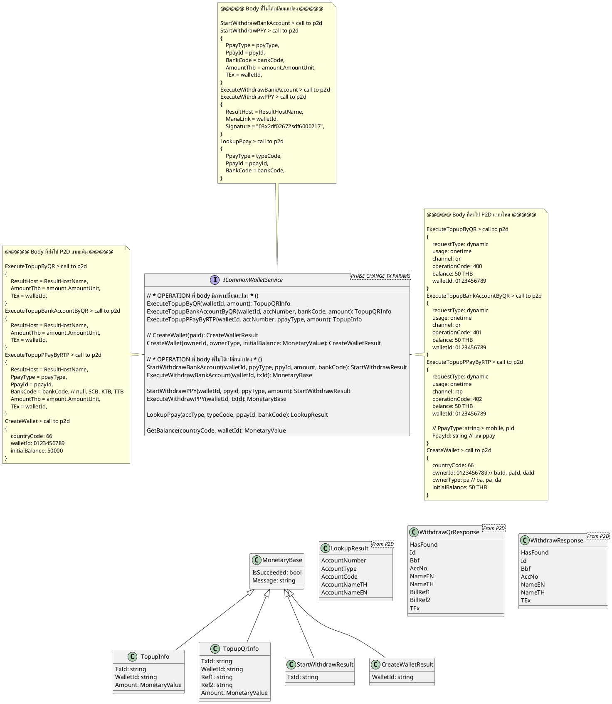
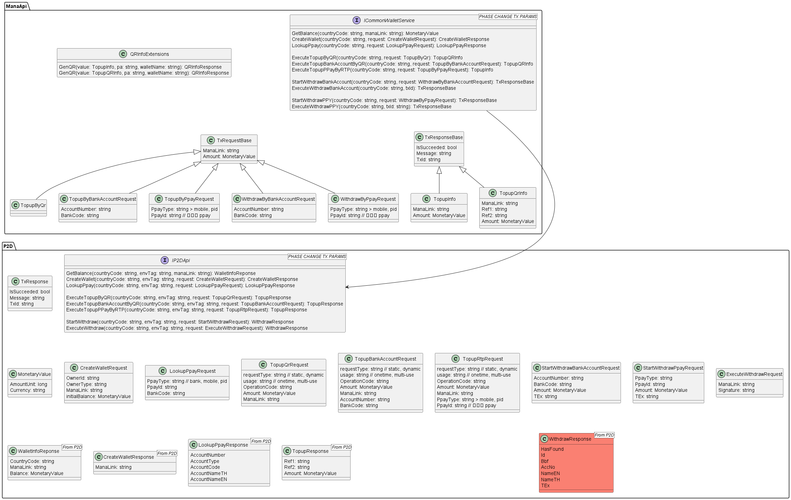

#mom #financial #202209 01
- doc id runner datetick จาก libs
- จะมีปรับ monetaryValue จาก libs
- ตอนปรับ code ปรับชื่อ filed ให้สอดคล้องกัน เช่น  billref1, billref2
- check flow ตั้งแต่ ส่ง ไปจนถึงรับ result MT จะปรับอะไรมั้ย

==============================================

# ปรับเพิ่มล่าสุด

- เพิ่ม country code
- ตอนจ่ายเงินใน mana ค่อยไปคุยเรื่อง Fee P2D ต่อ

```plantuml
@startuml financial-interface-tx-params-2

package ManaApi {

    interface ICommonWalletService <PHASE CHANGE TX PARAMS> {
        GetBalance(countryCode: string, manaLink: string): MonetaryValue
        CreateWallet(countryCode: string, request: CreateWalletRequest): CreateWalletResponse
        LookupPpay(countryCode: string, request: LookupPpayRequest): LookupPpayResponse

        ExecuteTopupByQR(countryCode: string, request: TopupByQrRequest): TopupQRInfo
        ExecuteTopupBankAccountByQR(countryCode: string, request: TopupByBankAccountRequest): TopupQRInfo
        ExecuteTopupPPayByRTP(countryCode: string, request: TopupByPpayRequest): TopupInfo

        StartWithdrawBankAccount(countryCode: string, request: WithdrawByBankAccountRequest): TxResponseBase
        ExecuteWithdrawBankAccount(countryCode: string, txId): TxResponseBase

        StartWithdrawPPY(countryCode: string, request: WithdrawByPpayRequest): TxResponseBase
        ExecuteWithdrawPPY(countryCode: string, txId: string): TxResponseBase
    }

    class TxRequestBase {
        ManaLink: string
        Amount: MonetaryValue
    }
    ICommonWalletService .[hidden].> TxRequestBase

    class TopupByQrRequest extends TxRequestBase {
    }

    class TopupByBankAccountRequest extends TxRequestBase {
        AccountNumber: string
        BankCode: string
    }

    class TopupByPpayRequest extends TxRequestBase {
        PpayType: string > mobile, pid
        PpayId: string // เลข ppay
    }

    class WithdrawByBankAccountRequest extends TxRequestBase {
        AccountNumber: string
        BankCode: string
    }

    class WithdrawByPpayRequest extends TxRequestBase {
        PpayType: string > mobile, pid
        PpayId: string // เลข ppay
    }

    class TxResponseBase {
        IsSucceeded: bool
        Message: string
        TxId: string
    }
    ICommonWalletService .[hidden].> TxResponseBase

    class TopupInfo extends TxResponseBase {
        ManaLink: string
        Amount: MonetaryValue
    }

    class TopupQrInfo extends TxResponseBase {
        ManaLink: string
        Ref1: string
        Ref2: string
        Amount: MonetaryValue
    }

    class QRInfoExtensions {
        GenQR(value: TopupInfo, pa: string, walletName: string): QRInfoResponse
        GenQR(value: TopupQRInfo, pa: string, walletName: string): QRInfoResponse
    }
}

package P2D {

    interface IP2DApi <PHASE CHANGE TX PARAMS> {
        GetBalance(countryCode: string, envTag: string, manaLink: string): WalletInfoReponse
        CreateWallet(countryCode: string, envTag: string, request: CreateWalletRequest): CreateWalletResponse
        LookupPpay(countryCode: string, envTag: string, request: LookupPpayRequest): LookupPpayResponse
        
        ExecuteTopupByQR(countryCode: string, envTag: string, request: TopupQrRequest): TopupResponse
        ExecuteTopupBankAccountByQR(countryCode: string, envTag: string, request: TopupBankAccountRequest): TopupResponse
        ExecuteTopupPPayByRTP(countryCode: string, envTag: string, request: TopupRtpRequest): TopupResponse

        StartWithdraw(countryCode: string, envTag: string, request: StartWithdrawRequest): WithdrawResponse
        ExecuteWithdraw(countryCode: string, envTag: string, request: ExecuteWithdrawRequest): WithdrawResponse
    }
    TopupByQrRequest -[hidden]d-> IP2DApi
    ICommonWalletService -d---> IP2DApi
    
    class TxResponse {
        IsSucceeded: bool
        Message: string
        TxId: string
    }

    class MonetaryValue {
        AmountUnit: long
        Currency: string
    }
    IP2DApi .[hidden].> MonetaryValue

    class WalletInfoReponse<From P2D> {
        CountryCode: string
        ManaLink: string
        Balance: MonetaryValue
    }
    MonetaryValue .[hidden].> WalletInfoReponse

    class CreateWalletRequest {
        OwnerId: string
        OwnerType: string
        ManaLink: string
        initialBalance: MonetaryValue
    }
    MonetaryValue .[hidden]r.> CreateWalletRequest

    class CreateWalletResponse<From P2D> {
        ManaLink: string
    }
    CreateWalletRequest .[hidden].> CreateWalletResponse

    class LookupPpayRequest {
        PpayType: string // bank, mobile, pid
        PpayId: string
        BankCode: string
    }
    CreateWalletRequest .[hidden]r.> LookupPpayRequest

    class LookupPpayResponse<From P2D> {
        AccountNumber
        AccountType
        AccountCode
        AccountNameTH
        AccountNameEN
    }
    LookupPpayRequest .[hidden].> LookupPpayResponse

    class TopupQrRequest {
        requestType: string // static, dynamic
        usage: string // onetime, multi-use
        OperationCode: string
        Amount: MonetaryValue
        ManaLink: string
    }
    LookupPpayRequest .[hidden]r.> TopupQrRequest

    class TopupBankAccountRequest {
        requestType: string // static, dynamic
        usage: string // onetime, multi-use
        OperationCode: string
        Amount: MonetaryValue
        ManaLink: string
        AccountNumber: string
        BankCode: string
    }
    TopupQrRequest .[hidden]r.> TopupBankAccountRequest

    class TopupRtpRequest {
        requestType: string // static, dynamic
        usage: string // onetime, multi-use
        OperationCode: string
        Amount: MonetaryValue
        ManaLink: string
        PpayType: string > mobile, pid
        PpayId: string // เลข ppay
    }
    TopupBankAccountRequest .[hidden]r.> TopupRtpRequest

    class TopupResponse<From P2D> {
        Ref1: string
        Ref2: string
        Amount: MonetaryValue
    }
    TopupQrRequest .[hidden].> TopupResponse

    class StartWithdrawBankAccountRequest {
        AccountNumber: string
        BankCode: string
        Amount: MonetaryValue
        TEx: string
    }
    TopupRtpRequest .[hidden]r.> StartWithdrawBankAccountRequest

    class StartWithdrawPpayRequest {
        PpayType: string
        PpayId: string
        Amount: MonetaryValue
        TEx: string
    }
    StartWithdrawBankAccountRequest .[hidden]r.> StartWithdrawPpayRequest

    class WithdrawResponse<From P2D> #Salmon {
        HasFound
        Id
        Bbf
        AccNo
        NameEN
        NameTH
        TEx
    }
    StartWithdrawBankAccountRequest .[hidden].> WithdrawResponse

    class ExecuteWithdrawRequest {
        ManaLink: string
        Signature: string
    }
    StartWithdrawPpayRequest .[hidden]r.> ExecuteWithdrawRequest

}

@enduml

```

#mom #202209 23 financial
- เพิ่ม contryCode ใน ICommonWalletService
- เช็ค method parameters ใน ICommonWalletService
- แยก topup qr/rtp ใน IP2DApi
- คิด P2DReciever result model ใน IP2DApi ต่อ
- note อันที่อธิบายเพิ่ม TEx, ManaLink

#mom #202209 27 financial
- P2DReciever result model > ส่ง countryCode กลับมั้ย ?
- contryCode ใน ICommonWalletService
    - mobile + server เป็นยังไง
    - userId ดู contryCode ได้ (ปัจจุบันยังเป็น DateTicks อยู่)
- design ให้ generalize หลายประเทศ