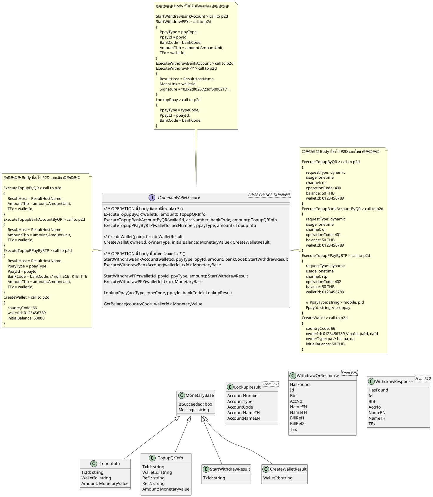
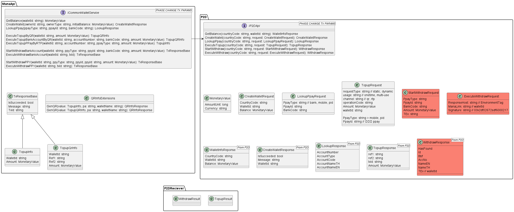

#mom #financial #202209 01
- doc id runner datetick จาก libs
- จะมีปรับ monetaryValue จาก libs
- ตอนปรับ code ปรับชื่อ filed ให้สอดคล้องกัน เช่น  billref1, billref2
- check flow ตั้งแต่ ส่ง ไปจนถึงรับ result MT จะปรับอะไรมั้ย

==============================================

# ปรับเพิ่มล่าสุด

ตอนจ่ายเงินใน mana คิดเรื่อง Fee P2D ต่อ

```plantuml
@startuml financial-interface-tx-params-2

package ManaApi {

    interface ICommonWalletService <PHASE CHANGE TX PARAMS> {
        GetBalance(walletId: string): MonetaryValue
        CreateWallet(ownerId: string, ownerType: string, initialBalance: MonetaryValue): CreateWalletResponse
        LookupPpay(ppayType: string, ppayId: string, bankCode: string): LookupResponse

        ExecuteTopupByQR(walletId: string, amount: MonetaryValue): TopupQRInfo
        ExecuteTopupBankAccountByQR(walletId: string, accountNumber: string, bankCode: string, amount: MonetaryValue): TopupQRInfo
        ExecuteTopupPPayByRTP(walletId: string, accountNumber: string, ppayType: string, amount: MonetaryValue): TopupInfo

        StartWithdrawBankAccount(walletId: string, ppyType: string, ppyId: string, bankCode: string, amount: MonetaryValue): TxResponseBase
        ExecuteWithdrawBankAccount(walletId: string, txId): TxResponseBase

        StartWithdrawPPY(walletId: string, ppyType: string, ppyId, ppyId: string, amount: MonetaryValue): TxResponseBase
        ExecuteWithdrawPPY(walletId: string, txId: string): TxResponseBase
    }

    class TxResponseBase {
        IsSucceeded: bool
        Message: string
        TxId: string
    }
    ICommonWalletService .[hidden].> TxResponseBase

    class TopupInfo extends TxResponseBase {
        WalletId: string
        Amount: MonetaryValue
    }

    class TopupQrInfo extends TxResponseBase {
        WalletId: string
        Ref1: string
        Ref2: string
        Amount: MonetaryValue
    }

    class QRInfoExtensions {
        GenQR(value: TopupInfo, pa: string, walletName: string): QRInfoResponse
        GenQR(value: TopupQRInfo, pa: string, walletName: string): QRInfoResponse
    }
    ICommonWalletService .[hidden].> QRInfoExtensions
}

package P2D {

    interface IP2DApi <PHASE CHANGE TX PARAMS> {
        GetBalance(countryCode: string, walletId: string): WalletInfoReponse
        CreateWallet(countryCode: string, request: CreateWalletRequest): CreateWalletResponse
        LookupPpay(countryCode: string, request: LookupPpayRequest): LookupResponse
        ExecuteTopup(countryCode: string, request: TopupRequest): TopupResponse
        StartWithdraw(countryCode: string, request: StartWithdrawRequest): WithdrawResponse
        ExecuteWithdraw(countryCode: string, request: ExecuteWithdrawRequest): WithdrawResponse
    }
    ICommonWalletService -r-> IP2DApi

    class MonetaryValue {
        AmountUnit: long
        Currency: string
    }
    IP2DApi .[hidden].> MonetaryValue

    class WalletInfoReponse<From P2D> {
        CountryCode: string
        WalletId: string
        Balance: MonetaryValue
    }
    MonetaryValue .[hidden].> WalletInfoReponse

    class CreateWalletRequest {
        CountryCode: string
        WalletId: string
        Balance: MonetaryValue
    }
    MonetaryValue .[hidden]r.> CreateWalletRequest

    class CreateWalletResponse<From P2D> {
        IsSucceeded: bool
        Message: string
        WalletId: string
    }
    CreateWalletRequest .[hidden].> CreateWalletResponse

    class LookupPpayRequest {
        PpayType: string // bank, mobile, pid
        PpayId: string
        BankCode: string
    }
    CreateWalletRequest .[hidden]r.> LookupPpayRequest

    class LookupResponse<From P2D> {
        AccountNumber
        AccountType
        AccountCode
        AccountNameTH
        AccountNameEN
    }
    LookupPpayRequest .[hidden].> LookupResponse

    class TopupRequest {
        requestType: string // static, dynamic
        usage: string // onetime, multi-use
        channel: string // qr, rtp
        operationCode: string
        Amount: MonetaryValue
        walletId: string

        PpayType: string > mobile, pid
        PpayId: string // เลข ppay
    }
    LookupPpayRequest .[hidden]r.> TopupRequest

    class TopupResponse<From P2D> {
        ref1: string
        ref2: string
        txId: string
        Amount: MonetaryValue
    }
    TopupRequest .[hidden].> TopupResponse

    class StartWithdrawRequest #Salmon {
        PpayType: string
        PpayId: string
        BankCode: string
        Amount: MonetaryValue
        TEx: string
    }
    TopupRequest .[hidden]r.> StartWithdrawRequest

    class WithdrawResponse<From P2D> #Salmon {
        HasFound
        Id
        Bbf
        AccNo
        NameEN
        NameTH
        TEx // walletId
    }
    StartWithdrawRequest .[hidden].> WithdrawResponse

    class ExecuteWithdrawRequest #Salmon {
        ResponseHost: string // EnvironmentTag
        ManaLink: string // walletId
        Signature: string // 03x2df02672sdf6000217
    }
    StartWithdrawRequest .[hidden]r.> ExecuteWithdrawRequest

}

package P2DReciever {
    class TopupResult { }
    class WithdrawResult { }
}
ICommonWalletService -[hidden]d--- P2DReciever

@enduml

```

