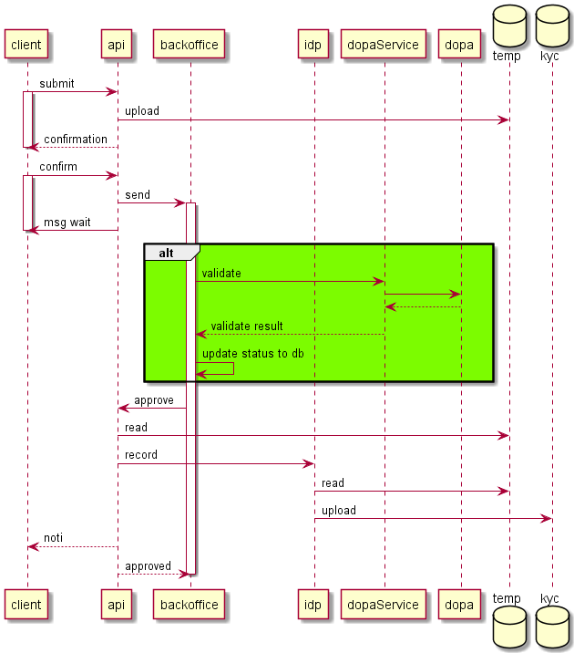

# kyc dopa
- ❌ mana api validate ตอนกรอกข้อมูลเลย
- ❌ backoffice api validate ผ่าน mana api ตอน mana api hook มา แล้วแสดงผลให้ operator
- ✅ backoffice api validate โดยตรงกับ dopa ตอน mana api hook มา แล้วแสดงผลให้ operator
    - ผ่าน > operator กดปุ่ม approve/reject ได้
    - ไม่ผ่าน > operator กดปุ่ม reject ได้
    - เชื่อมต่อไม่ได้ > มี module revalidate รอจนกว่าจะเชื่อมต่อได้
- ❗ แผนสำรองกรณี implement เชื่อม dopa ไม่เสร็จ > operator ใช้ เลขบัตร+เลเซอร์ไอดี เช็คที่ [https://citizenservice.dopa.go.th](https://citizenservice.dopa.go.th)

# upload file > fill form
