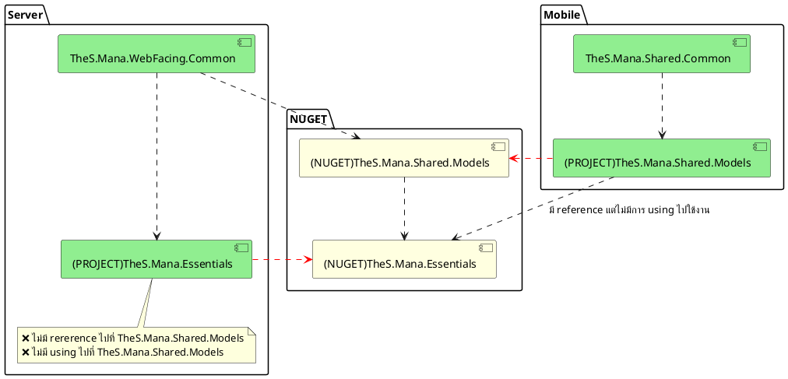

# libs recursive

## เช็คจุดต่างๆ

- เช็ค reference nuget/project
- เช็คเรื่องการ build จาก project ไป nuget
- เช็ค src code การ using ใน class
- เช็คย้อนหลัง
    - ก่อน xapimana จะอัพเดท libs & dotnet6
    - สุ่มเช็คก่อนหน้านั้นอีก 1 ครั้ง
- เช็ค release pipeline ของ libs TheS.Mana.Shared.Models
    - devops project ManaPlatform มีถึงแค่ v0.8.5.pre135
    - devops project ManaLaunch v0.8.5.pre169 - v0.8.5.pre171 (lastest)
- server ก่อนอัพเดท libs ใช้ TheS.Mana.Shared.Models v0.8.5.pre138

## จุดไม่ปกติ

- TheS.Mana.Shared.Models มี reference NUGET TheS.Mana.Essentials แต่ไม่มีที่ใช้งาน และไม่เป็น recursive
    - ลองเอา using TheS.Mana.Essentials ออก
- ที่ server ก่อนอัพเดท libs ถ้าอัพ TheS.Mana.Shared.Models จาก v0.8.5.pre138 เป็น v0.8.5.pre152 ขึ้นไป วิธีการ setup project จะเปลี่ยนไป
    - รอ libs ใหม่ แล้ว guide วิธี setup แบบใหม่ทีเดียว

