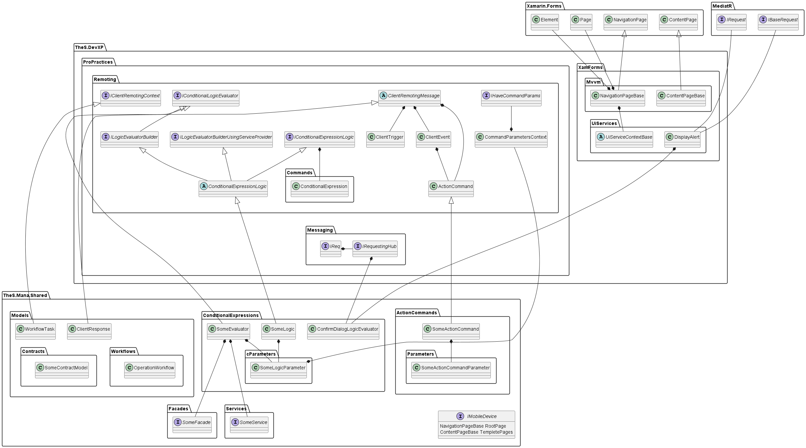
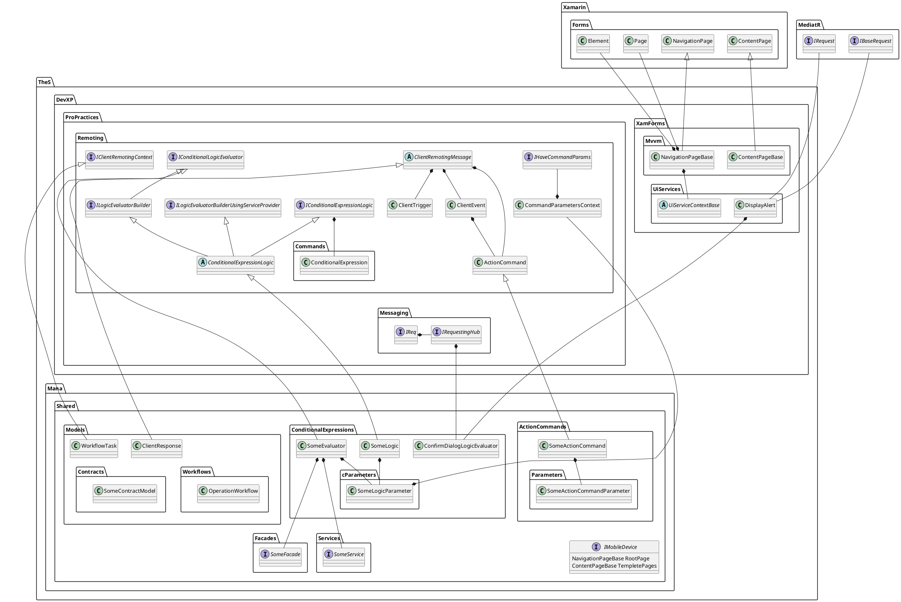

# TheS.Mana.Shared ที่มีการใช้งานใน server

1. TheS.Mana.Shared.Models.**ClientResponse**
1. TheS.Mana.Shared.Models.**OperationWorkflow**
1. TheS.Mana.Shared.ActionCommands.**[xxxActionCommand*]**
1. TheS.Mana.Shared.ActionCommands.Parameters.**[xxxActionCommandParameter*]**
1. TheS.Mana.Shared.ConditionalExpressions.**[xxxLogic*]**
1. TheS.Mana.Shared.ConditionalExpressions.Parameters.**[xxxLogicParameter*]**

# TheS.DevXP ที่มีการ ref จาก TheS.Mana.Shared

1. TheS.DevXP.ProPractices.Remoting.**ClientRemotingMessage** [abstract]
1. TheS.DevXP.ProPractices.Remoting.**ClientTrigger** [class]
1. TheS.DevXP.ProPractices.Remoting.**ClientEvent** [class]
1. TheS.DevXP.ProPractices.Remoting.**ActionCommand** [class]
1. TheS.DevXP.ProPractices.Remoting.**IClientRemotingContext** [interface]
1. TheS.DevXP.ProPractices.Remoting.**IConditionalExpressionLogic** [interface]
1. TheS.DevXP.ProPractices.Remoting.**ILogicEvaluatorBuilder** [interface]
1. TheS.DevXP.ProPractices.Remoting.**ILogicEvaluatorBuilderUsingServiceProvider** [interface]
1. TheS.DevXP.ProPractices.Remoting.**IConditionalLogicEvaluator** [interface]
1. TheS.DevXP.ProPractices.Remoting.**IHaveCommandParams** [interface]
1. TheS.DevXP.ProPractices.Remoting.**ConditionalExpressionLogic** [abstract]
1. TheS.DevXP.ProPractices.Remoting.**CommandParametersContext** [class]
1. TheS.DevXP.ProPractices.Remoting.Commands.**ConditionalExpression** [class]
1. TheS.DevXP.ProPractices.Remoting.Messaging.**IRequestingHub** [interface]
1. TheS.DevXP.ProPractices.Remoting.Messaging.**IReq** [interface]
1. TheS.DevXP.XamForms.UiServices.**DisplayAlert** [class]
1. TheS.DevXP.XamForms.UiServices.**UiServiceContextBase** [abstract]
1. TheS.DevXP.XamForms.Mvvm.**NavigationPageBase** [class]
1. TheS.DevXP.XamForms.Mvvm.**ContentPageBase** [class]

# ref ที่เกี่ยวข้อง

# เพิ่มเติม
1. TheS.Mana.Shared มี TheS.Mana.Essentials แต่ไม่มีการใช้งาน