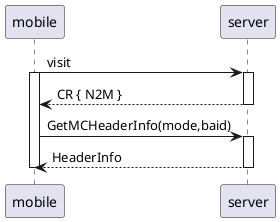

# MCotent Header

## โจทย์ : MCHeader null คือแสดงแบบ default
## การทำงานปัจจุบัน

- ปัจจุบันดึงข้อมูลร้านจาก mode+baid (baid มาจาก MContentInfo ใน N2M cmd)
    - ถ้า MCHeader เป็น null เอา baid มาจากไหน ?
        - ต้องไม่ใช้ baid mana ป้องกันสวมรอย
        - ถ้าหา baid ไม่ได้จริงๆ แสดง unknown biz
    - เปลี่ยน ตอนดึงข้อมูลร้านใช้ parameter ที่ common ขึ้น
        - ใช้ endpointid หน้านั้นแทน mode+baid
            - ปกติ 3rd เวลา regis endpoint จะต้องส่ง baid มาด้วย ถ้าใช้ endpointid หน้านั้น แทน endpointid มาจะเอาไปค้น รายละเอียดร้านต่อได้
            - endpointid รู้ mode อยู่แล้ว
            - ตอน visit endpoint > response ไม่ต้องส่ง baid ไปกับ MContentInfo แล้ว จะเหลือแค่ mode ก็พอ (ซึ่งจริงๆส่งไปแค่ mode none/banner ก็พอ)
    - ❌เปลี่ยน ตอนที่ส่ง N2M cmd ให้ส่งข้อมูลร้านมาให้ครบเลย
        - ไม่ต้องการให้ model ข้อมูลร้าน fixed อยู่ในใน mobile
            - ❓❌ ข้อมูลร้านเป็น type dynamic/object
                - ข้อมูล setup (MContentInfo) กับข้อมูลหน้า (data model) ควรแยกส่วนกัน
- แก้ zip mana flow N2M cmd ทุกอันต้องใส่หัวแบบ none
- แก้ server mana flow N2M cmd ทุกอันต้องใส่หัวแบบ none
