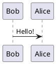
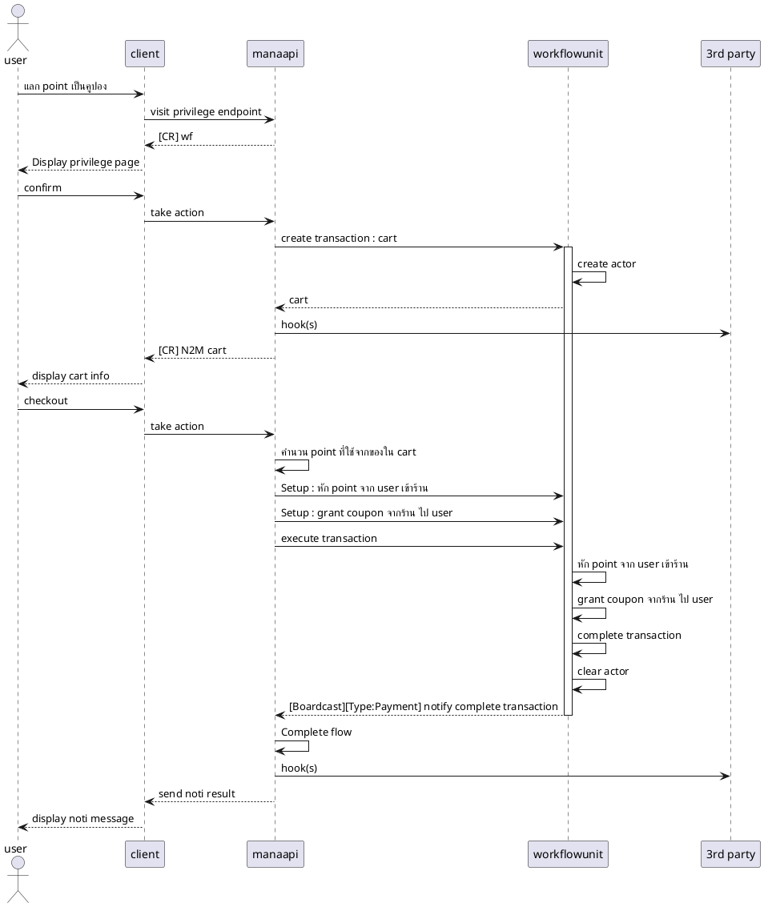
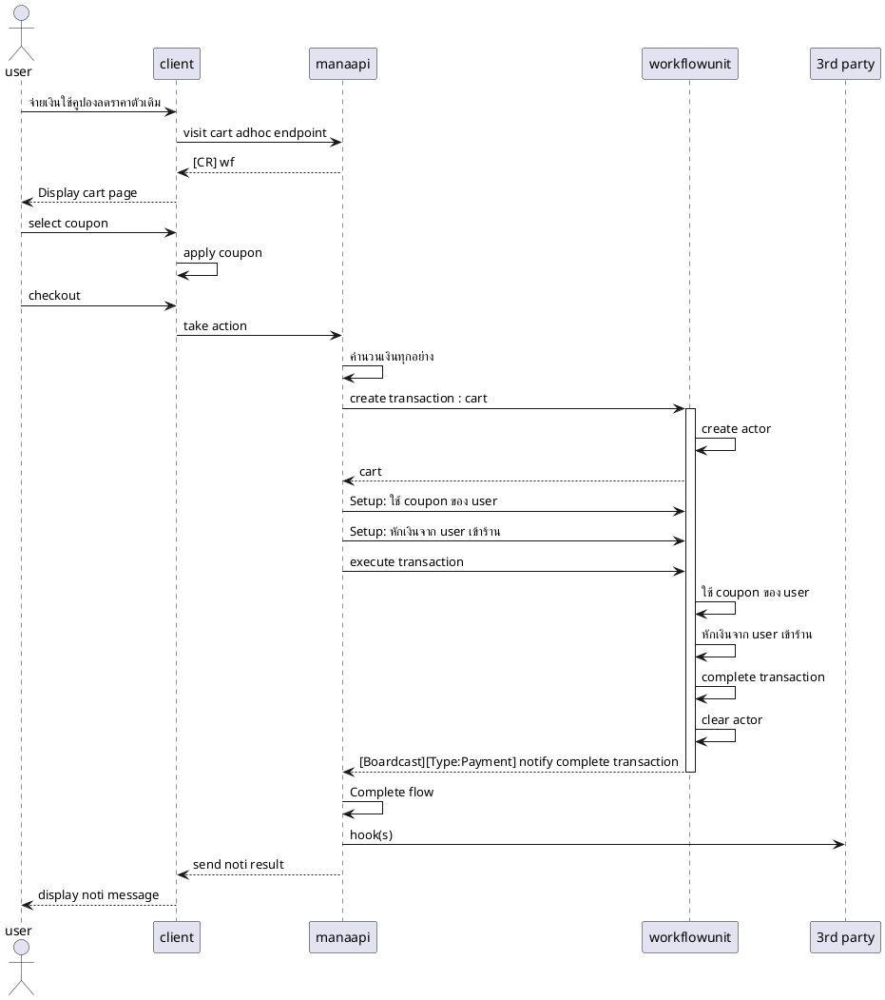
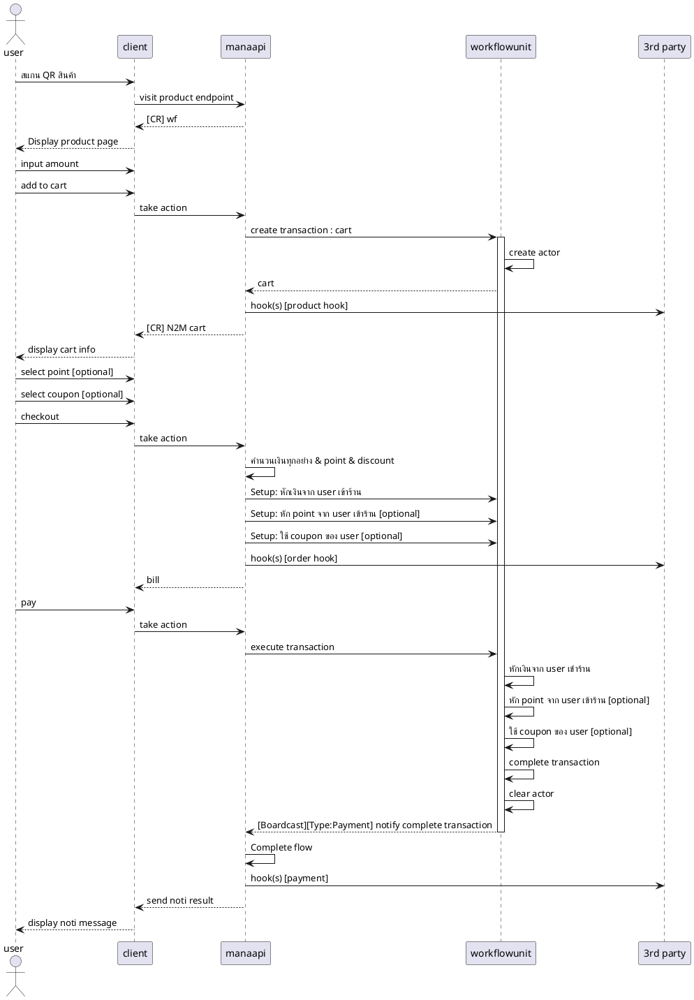
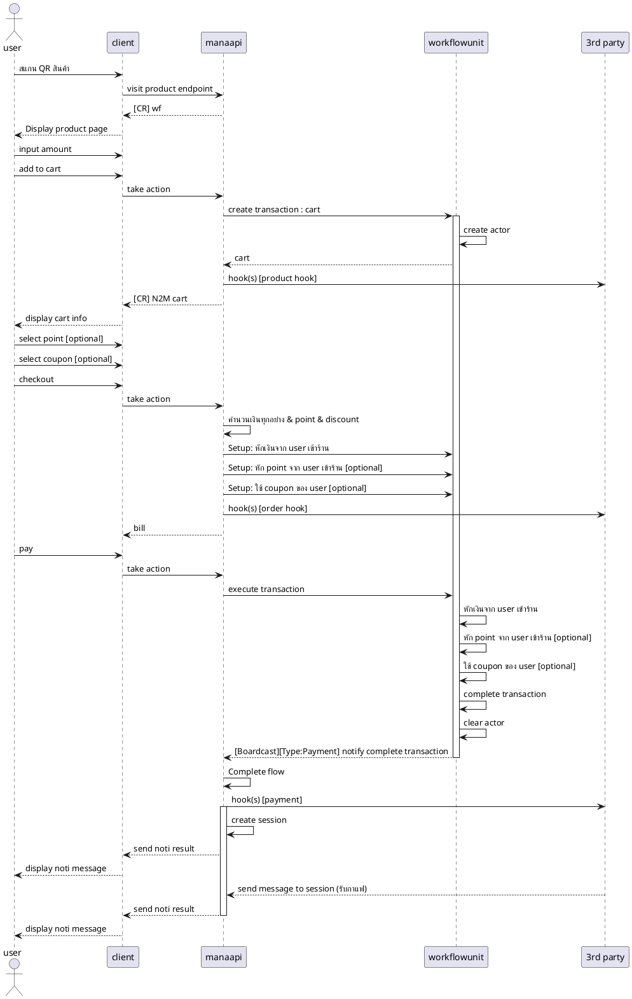
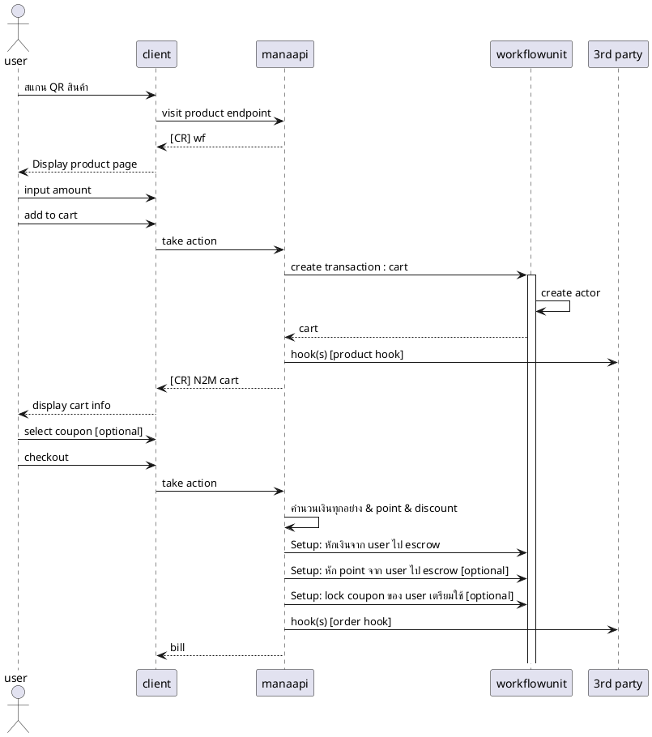
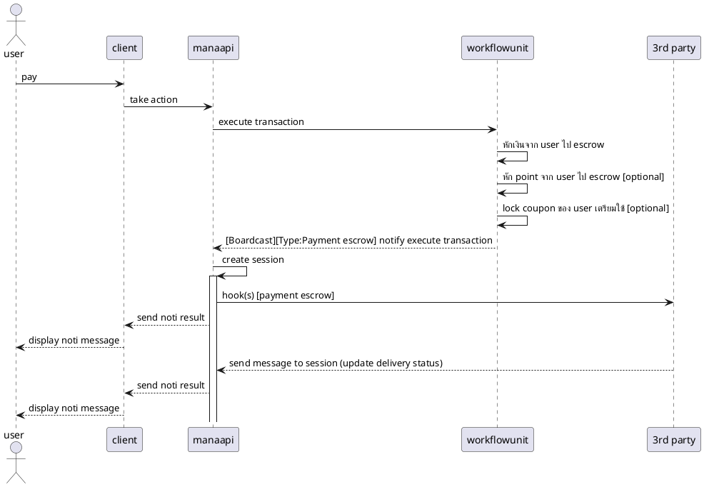
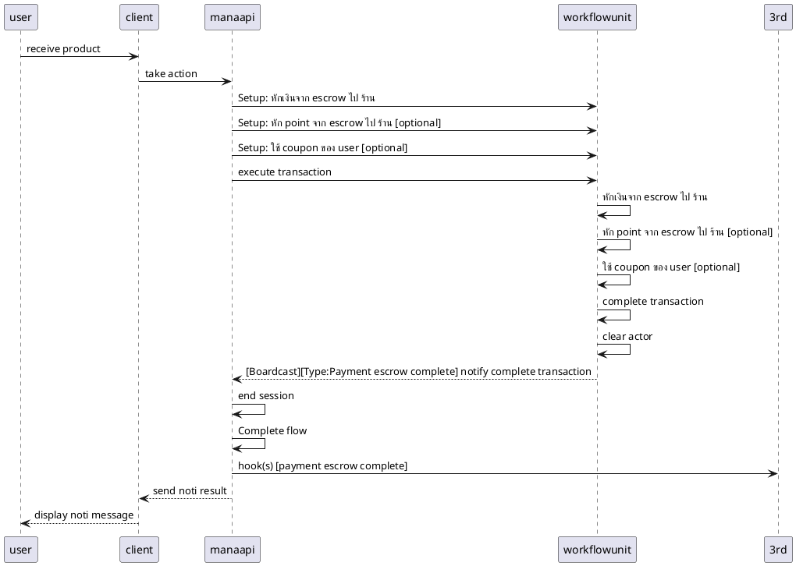
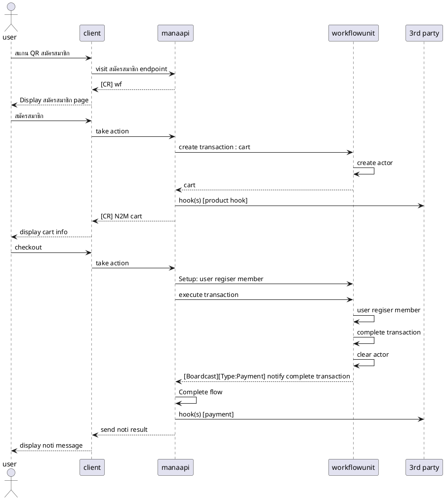

# Eslip (ตัวเดิม)
- ## [create / update / delete] eslip stub (ตัวเดิม)
- ## [create / update / delete] eslip distribution (qr) (ตัวเดิม)
- ## [receive / use] eslip (ตัวเดิม)
    - ยังใช้ตัวเดิม => เป็นแค่ setup ข้อมูล ไม่ได้ใช้ wfu
- ## [receive / use] eslip CouponCart (คูปองลดราคาตัวเดิม)
    - ใช้ผ่านหน้าจ่ายเงินร้านค้า adhoc => ดูต่อ wfu adhoc

# Eslip New concept

later ...

Image

# Privilege
- ## [create / update / delete] privilege
    - เป็นแค่ setup ข้อมูล ยังไม่ได้ใช้ wfu
- ## [แลก point เป็นคูปอง]

Image

- scenarios
    - กด link ของที่จะซื้อ
    - เพิ่มเข้าตะกร้า
        - สำเร็จ
        - สินค้าหมด
        - สมัครสมาชิกก่อน
            - กดสมัคร
            - ไม่สมัคร
        - ยังไม่ถึงเวลา
        - หมดอายุ
    - เช็คเอ้า
        - สำเร็จ
        - สินค้าหมด
        - สมัครสมาชิกก่อน
            - กดสมัคร
            - ไม่สมัคร
        - ยังไม่ถึงเวลา
        - หมดอายุ
        - พ้อยไม่พอ
    - ยกเลิกตะกร้า
- common services
    - CRUD
    - Validate
    - AddToCart
    - CancelCart
    - Purchase

# Cart adhoc
- ## จ่ายเงินใช้ [คูปองลดราคา(ตัวเดิม)]

Image

# Cart & prdoducts
- ## จ่ายเงินแบบเต็มรูปแบบ

Image

# Cart & prdoduct & reminder (coffee shop)
- ## จ่ายเงินแบบเต็มรูปแบบ และมี session ส่งข้อความหลังจากจ่ายเงิน

Image

# Cart & prdoduct & reminder & delivery (escrow)
- ## จ่ายเงินแบบเต็มรูปแบบ 
    - มี session สถานะการขนส่ง หลังจากจ่ายเงิน
    - ลูกค้าจ่ายเงินเข้า esscrow ก่อน
    - ร้านได้รับเงินหลังจากลูกค้ารับสินค้า

สั่งซื้อ

---

จ่ายเงิน

---

รับของ

# Membership New concept
- ## สมัครสมาชิกผ่าน cart

Image

