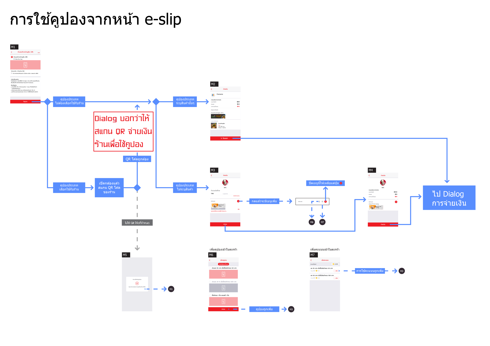

# แลกของ
- Major  ตั๋วหนัง Deluxe 1 ใบ มูลค่า 160 บาท

# ระบุสินค้า
### ฟรี
- แล้วแต่ กะเพราแท้ ระดับโลกเฮ้ย  กะเพราหมูสับ+ไข่ข้น
- กาแฟดึงดูด  นมเย็น+ขนมปัง
- ครัวโอม  ข้าวกระเพราหมูกรอบไข่ดาว
- เพื่อนละยำ  ยำหมูกรอบ
### ลด
- Grandline Cafe      ชาไทยเย็น 25 บาท (ราคาปกติ 50 บาท) 
- Beta House  ฟรี ฉายคู่ มูลค่า 139 บาท
- On-Zon ออนซอน แจ่วฮ้อน&ชาบู - ขอนแก่น  คูปองทานบุฟเฟต์ ร้านออนซอนชาบูในราคาเพียง 79 บาท (จากราคาปกติ 149 บาท)

# ระบุประเภทสินค้า
### ฟรี
- Chincha since 2018    คูปองเมนูน้ำ ราคา 35 บาท
- เรือนนางขนมไทย  ขนมไทย 60 บาท
- WIB  เมนูเย็นราคาไม่เกิน 50 บาท
- mongni    แลกเมนู 35 บาท
### ลด
- เป็ดย่างเลอระเริง  ข้าวหน้าเป็ดย่าง,หมูกรอบ,หมูแดง มูลค่า 29 บาท (ราคาปกติ 40 บาท)

# ลดราคา สินค้าทุกชนิด
### ฟรี
- UYU Cha cafe    ทุกเมนู 35 บาท

***

# ISSUES
1. ~~flow purchase ?~~ => มีแล้ว
1. ~~flow use from eslip menu ?~~ => มีแล้ว
1. ~~flow user from cart ?~~ => มีแล้ว
1. privilege แลกแต้มได้คูปองแบบเก่าก่อน ลงรายละเอียด flow

# Ideas
- ## สร้าง privilege คือการสร้าง product ที่
    - มีราคาเป็น point
    - สามารถเป็น digital content ซื้อแล้วได้คูปองเลย
    - ซื้อผ่านตะกร้า 
        <details>
        <summary>Image</summary>
        
        </details>
    - ซื้อแล้ว coupon ส่งเข้า user เลย เพราะเป็น digital content
    - มี PaymentHook/ReceiveEslipHook ตามปกติ
- ## ใช้
    - ใช้ผ่าน eslip menu (ซึ่งอาจจะข้ามวิธีนี้ไปก่อน)
        <details>
        <summary>Image</summary>
        
        </details>
    - ใช้ผ่านตอนจะจ่ายเงิน แล้วเพิ่มใส่ตะกร้า
        <details>
        <summary>Image</summary>
        
        </details>

- ## privilege แลกแต้มได้คูปองแบบเก่าก่อน ลงรายละเอียด flow
    - โครงสร้าง eslip แบบเก่า
        <table style="border:solid 1px;text-align:center">
        <tr>
        <td colspan="11" style="border:solid 1px;text-align:center">Eslip Stub (บ้านมอ) 10</td>
        </tr>
        <tr>
        <td colspan="10" style="border:solid 1px;text-align:center">Eslip Quota (บ้านมอ) 10</td>
        </tr>
        <tr>
        <td colspan="2" style="border:solid 1px;text-align:center">Eslip QR 2</td>
        <td colspan="3" style="border:solid 1px;text-align:center">Eslip QR 3</td>
        <td colspan="5" style="border:solid 1px;text-align:center">Eslip QR 5</td>
        </tr>
        <tr>
        <td style="border:solid 1px;text-align:center">Eslip Tail</td>
        <td style="border:solid 1px;text-align:center">Eslip Tail</td>
        <td style="border:solid 1px;text-align:center">Eslip Tail</td>
        <td style="border:solid 1px;text-align:center">Eslip Tail</td>
        <td style="border:solid 1px;text-align:center">Eslip Tail</td>
        <td style="border:solid 1px;text-align:center">Eslip Tail</td>
        <td style="border:solid 1px;text-align:center">Eslip Tail</td>
        <td style="border:solid 1px;text-align:center">Eslip Tail</td>
        <td style="border:solid 1px;text-align:center">Eslip Tail</td>
        <td style="border:solid 1px;text-align:center">Eslip Tail</td>
        </tr>
        </table>

    - สร้าง CouponCart
        - admin promome สร้าง eslip ประเภท CouponCart
        - ระบบสร้าง ```Eslip Stub``` และ ```Eslip Quota``` ของ ```บ้านมอ```
    - สร้าง privilege แบบ coupon
        - admin promome สร้าง Privilege แบบ coupon
        - ระบบสร้าง Product เป็น digital content ประเภทคูปอง
            ```json
            {
                "Title":"50% Discount",
                "Image":"https://xxx.com/1.png",
                "Price":"100",
                ~~~"Currency":"THB",~~~
                "Currency":"Coin",
                "CurrencyRefId":"promome-membership-id-123456789",
                "Type":"DigitalContent",
                "DigitalContentType":"CouponCart",
                "DigitalContentRefId":"eslip-stub-id-123456789",
            }
            ```
        - ระบบเพิ่มราคา product เป็น point
            ```json
            {
                "ProductId":"prod-123456789",
                "Price":"10",
                "Currency":"Coin",
                "CurrencyRefId":"promome-membership-id-123456789",
            }
            ```
        - ได้ ```product endpoint``` เอาไปใส่ในหน้ารายการ privilege ของ ```promome membership page```
    - user แลก privilege
        - user visit ```product endpoint``` ผ่าน ```promome membership page```
        - เข้าหน้า product ที่มีช่องจำนวน และป่ม [+] [-] [เพิ่มเข้าตะกร้า]
        - เพิ่มเข้าตะกร้าแล้วไปหน้า cart
        - กดจ่ายเงิน
        - ระบบสร้าง ```Eslip QR``` แล้วแจก ```Eslip Tail``` ให้ user
- ## สิ่งที่จะต้องทำ
    - Mana
        - สร้าง ```product เป็น digital content ประเภทคูปอง``` ได้
        - เพิ่มทางเลือกการจ่ายเงินเป็น point ได้
        - ชำระสินค้าเป็น point ได้
        - ซื้อ ```product เป็น digital content ประเภทคูปอง``` แล้วได้คูปองเลย
        - 
    - promome
        - ```privilege menu``` call ```mana 3rd api``` เพื่อสร้าง product และ เพิ่มทางเลือกการจ่ายเงินเป็น point
        - เอา ```product endpoint``` ไปใส่หน้า membership privilege

- point store like cash
- create product digital content
- add point collectible
