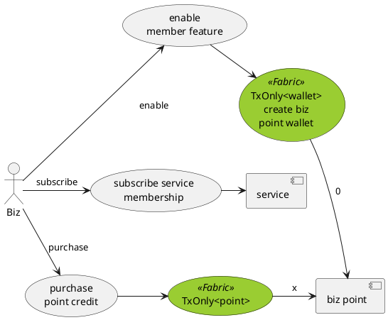
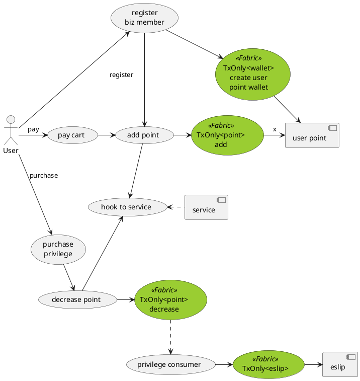

```plantuml
@startuml

skinparam usecase {
	BackgroundColor<< Fabric >> YellowGreen
}

(TxOnly<wallet>\ncreate biz\npoint wallet)<< Fabric >>
(TxOnly<point>)<< Fabric >>

Biz -up-> (enable\nmember feature) : enable
(enable\nmember feature) -> (TxOnly<wallet>\ncreate biz\npoint wallet)
(TxOnly<wallet>\ncreate biz\npoint wallet) -> [biz point] : 0

Biz -> (subscribe service\nmembership) : subscribe
(subscribe service\nmembership) -> [service]
 
Biz -down-> (purchase\npoint credit) : purchase
(purchase\npoint credit) -> (TxOnly<point>)
(TxOnly<point>) -> [biz point] : x

@enduml
```

```plantuml
@startuml

skinparam usecase {
	BackgroundColor<< Fabric >> YellowGreen
}

(TxOnly<wallet>\ncreate user\npoint wallet)<< Fabric >>
(TxOnly<point>\nadd)<< Fabric >>
(TxOnly<point>\ndecrease)<< Fabric >>
(TxOnly<eslip>)<< Fabric >>

User -up-> (register\nbiz member) : register
(register\nbiz member) -> (TxOnly<wallet>\ncreate user\npoint wallet)
(TxOnly<wallet>\ncreate user\npoint wallet) -> [user point] : 0
(register\nbiz member) -> (add point)
(add point) -> (TxOnly<point>\nadd)
(TxOnly<point>\nadd) -> [user point] : x

User -> (pay cart) : pay
(pay cart) -> (add point)
(add point) -down-> (hook to service)
[service] .left.> (hook to service)

User -down-> (purchase\nprivilege) : purchase
(purchase\nprivilege) -> (decrease point)
(decrease point) -up-> (hook to service)
(decrease point) -> (TxOnly<point>\ndecrease)
(TxOnly<point>\ndecrease) .down.> (privilege consumer)
(privilege consumer) -> (TxOnly<eslip>)
(TxOnly<eslip>) -> [eslip]

@enduml
```