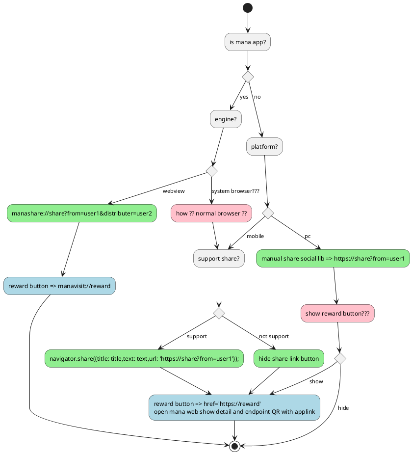

Plantuml: Server = https://plantuml.com/plantuml
# Promotion flow
- url in promotion
    - share link url
    - reward url
- sharing
    - on mana
    - off mana
- url scheme + catch NavigateOrRequesting
    - https
    - manashare
    - manavisit

