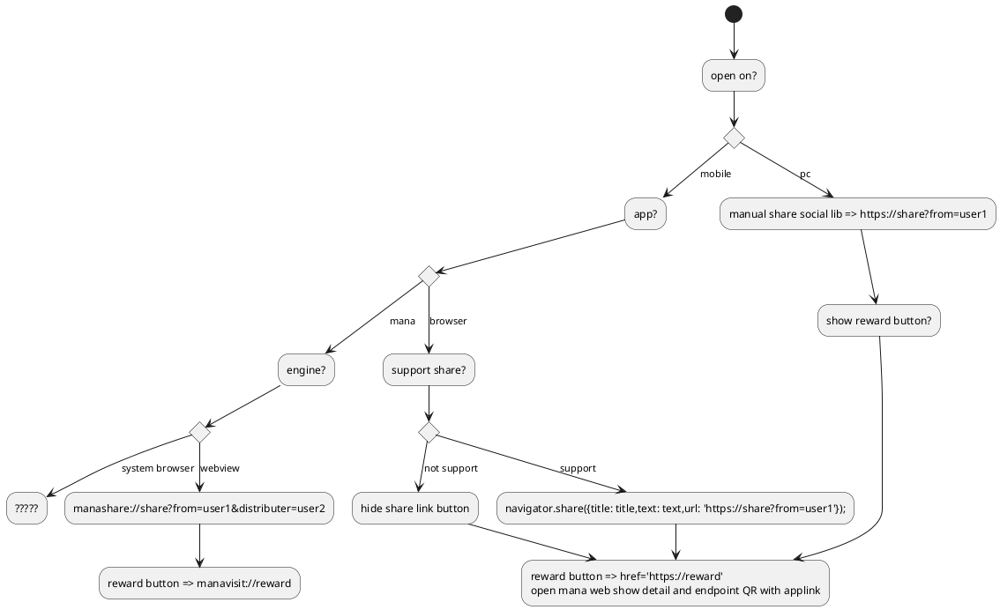

```plantuml
@startuml
(*) --> "open on?"
if "" then
    -->[mobile] "app?"
    if "" then
        -->[browser] "support share?"
        if "" then
            -->[support] "navigator.share({title: title,text: text,url: 'https://share?from=user1'});"
            --> "reward button => href='https://reward'\nopen mana web show detail and endpoint QR with applink"
        else
            -->[not support] "hide share link button"
            --> "reward button => href='https://reward'\nopen mana web show detail and endpoint QR with applink"
        endif
    else
        -->[mana] "engine?"
        if "" then
            -->[webview] "manashare://share?from=user1&distributer=user2"
            --> "reward button => manavisit://reward"
        else
            -->[system browser] "?????"
        endif
    endif
else
    -->[pc] "manual share social lib => https://share?from=user1"
    --> "show reward button?"
    --> "reward button => href='https://reward'\nopen mana web show detail and endpoint QR with applink"
endif
@enduml
```