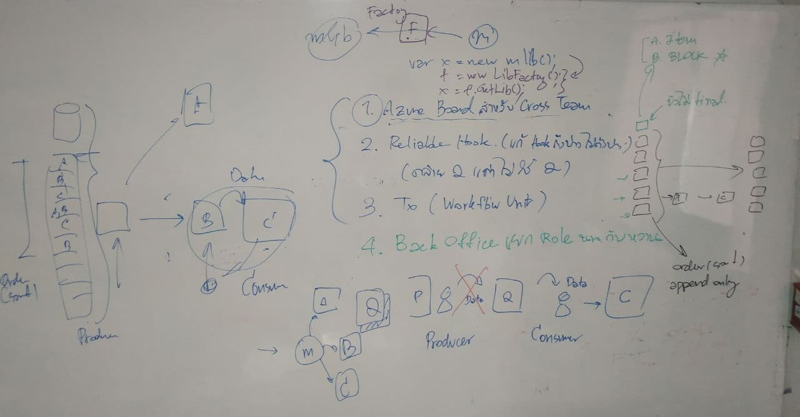
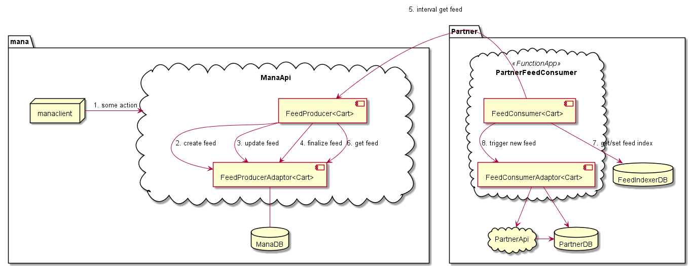
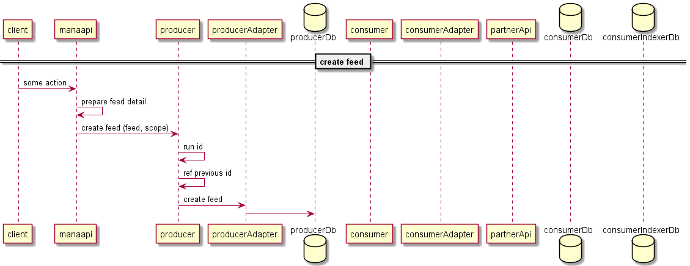
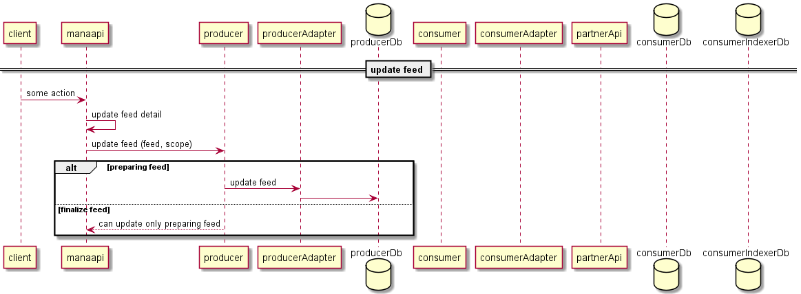
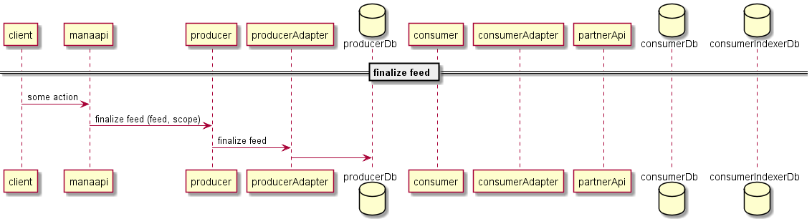
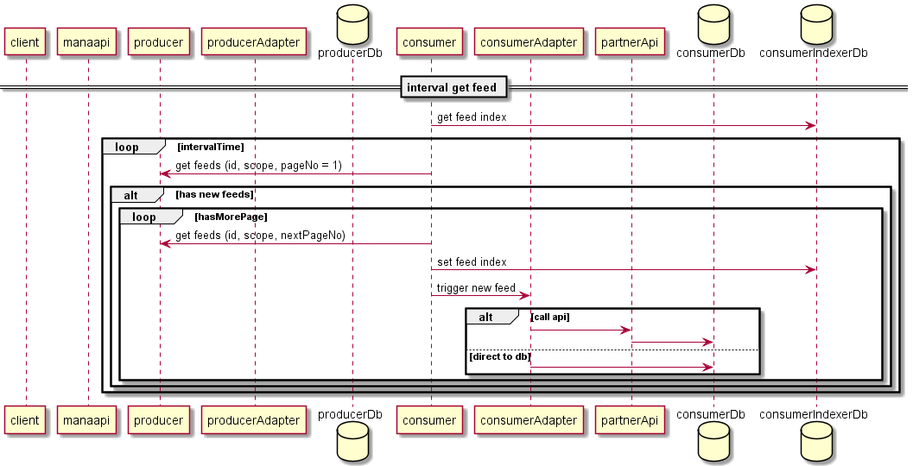
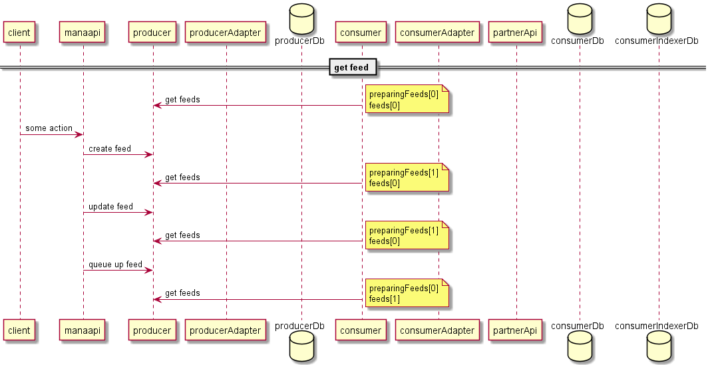
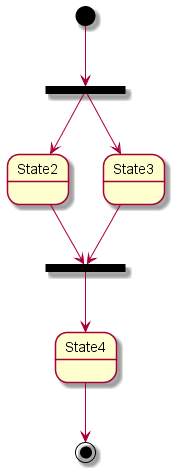
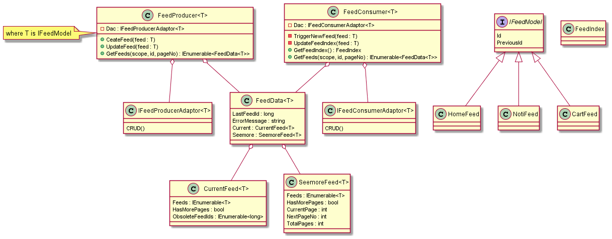
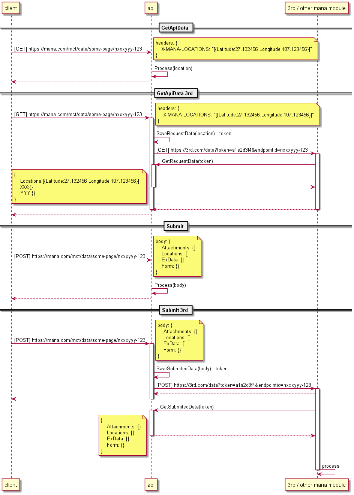

# Reliable hook

ได้รับลักษณะไหน ให้ส่งต่อแบบเดียวกัน

- hook type
    - notify
    - getData
    - hook
    - hookResponse
    - hookTrack

- http method
    - get
        - รอ response [getData]
        - ไม่รอ response [notify]
    - post
        - รอ response [hookResponse]
            - cart hook
            - checkout hook
        - ไม่รอ response [hook]
            - add product hook
            - submit form hook
        - ไม่รอ response + track status [hookTrack]
            - payment hook

## Primitive service

### raws

### limitations
- consumer อ่านจาก producer อย่างเดียว

### type
- data changed ?
    - user member
    - merchant member
    - ❌ privilege > cart
- ✅ feed
    - homefeed
    - noti
    - order > checkout
    - payment > paid
    - ❌ eslip > cart
    - form post hook
- request/response
    - data hook > getApiData
    - product hook
    - cart > add/remove product, change detail
- notify
    - biz data change
        - ba
        - da
        - ca

### services
- producer
- consumer

### model
- data model inherits [feed model interface]
- [feed indexer model]

### function
- producer
    - create feed (feeds) >> สร้าง feed ภายใน scope ที่กำหนด
    
    
    - update feed (feeds) >> แก้ไข feed ที่ยังไม่ finalize
    
    
    - finalize feed >> เปลี่ยน feed เป็นสถานะเส็จแล้ว
    
    
    - get feeds (scope, id, pageNo) > from db adaptor
    
- producerAdaptor > inerface
- consumer
    - get feeds (scope, id, pageNo) > from producer
        - update index
        - trigger new feed
    

- consumerAdaptor > inerface

<!-- ### Flow

- sequence

- state

### Classes

 -->

<!--  -->
