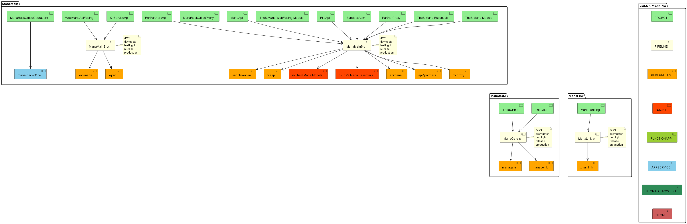

# Repo/Pipeline Objective
- scope ที่ทำ
- ปัจจุบันเป็นแบบไหน
- ไอเดียเริ่มต้น

# Scope

- ✅ ManaMain
- ManaService
- ManaExService
- ✅ ManaGate
- ManaIdp
- ManaSupport
- ✅ ManaApp
- ✅ ManaLink
- ManaSdk
- ManaTest
- Proposal
- DeliveryApi
- ✅ DeliveryApp

# Current

# Ideas

## ManaMain

## ManaService

## ManaExService

## ManaGate

## ManaIdp

## ManaSupport

## ManaApp

## ManaLink

## ManaSdk

## ManaTest

## Proposal

## DeliveryManagementWebApp

## RestaurantApp

## RiderApp

## JsDevLib
