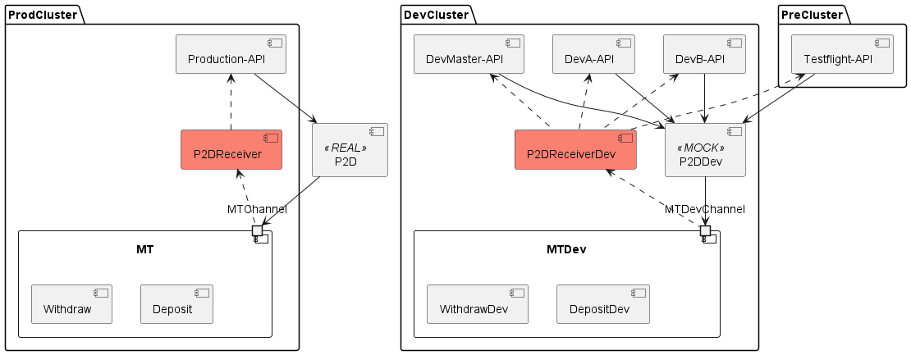

# dev & prod - p2d

## จาก [ประเด็นคิดต่อ] p2d dev & prod #mom #202209 01 **REF: [dev & prod](dev-and-prod.md)**

- 0.1 ✅ MT อาจจะเปลี่ยนเป็น reliable hook ในอนาคต
- 0.2 MT config แบบไหน ตาม requirement
    - 🙋‍♂️ ถ้า MT topic สามารถ config แยกแต่ละ ring ได้ น่าจะแก้ปัญหาให้ไม่ชนกัน
1. ถ้าเทสเรื่องการเงินเคสต่างได้
2. effort operation อื่นในการเงิน
3. ✅ เคส lookup เอาจาก db
4. เคสอื่นนอกจาก lookup

- ใช้ MT ตัวเดียวกันทั้งหมด
- สร้าง channel MT แต่ละ ring ไว้
- ถ้ามีการ dev ของที่เกี่ยวกับ MT จะต้อง deploy P2DDev ของแต่ละ ring
- สร้าง config MT channel แต่ละ ring ไว้
- DevAPI รับ message จาก MT channel แยก ring ตามที่ config ไว้แล้ว
- P2DDev ส่ง message ไปที่ MT channel แยก ring ตามที่ config ไว้แล้ว

=======================================================

- ใช้ MT ตัวเดียวกันทั้งหมด
- สร้าง channel MT เซตเดียว
- เพิ่ม receiver สำหรับรับ result จาก MT
- receiver ตอบกลับเป็น http call
