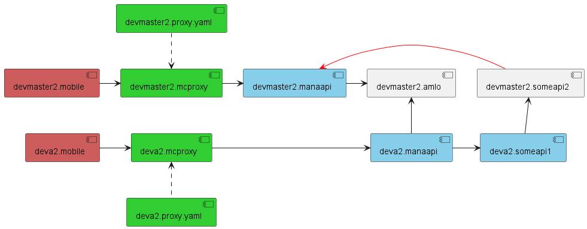

- จาก #mom
```
#mom Release Engineer

- apim
    0. ✅ มี 6 ตัว
        > pipeline auto move ring > manual copy ไปก่อน
    2. จัดการกลุ่ม api
    3. ✅ เอา secret key apim มายังไง
    4. 3rd dev เล่น playground
        > final idp login

===================================

- repo/pipeline
    - แยก/รวม ring
        - ⌛ ไอเดียเริ่มต้น แยก env ขาด
        - ⌛ devmaster พร้อมใช้ทุกอย่าง จะ dev ตัวไหนให้ deploy แค่ตัวนั้นแยก ring
            - ควรทำมั้ย
            - กระทบอะไรมั้ย
            - ถ้าทำ setup process จะเป็นแบบไหน
    - kubernetes/webapp
        - zip wf/mcontent/apptext pipeline use zip tool
        - zip tool for 3rd
            - web content
            - etc
        - apptext testcase
    - JsLib > ตอนนี้ manual > auto ได้ก็ดี
```


## ✅ จุดประสงค์
- ปรับให้ dev ring มี kube deployment กลุ่มหลัก 1 กลุ่ม
- สามารถแยกการทำงาน deployment ที่จะ dev เฉพาะตัวที่เกี่ยวข้อง ไม่ให้กระทบกับ ring อื่น แล้ว deployment ทำงานที่ตัวหลักได้ตามปกติ
- สามารถแยกการใช้งาน db/collection ที่กำลัง dev ไม่ให้กระทบกับ ring อื่น
- [รอง] optimize kube node pool
- [รอง] optimize db resouce

## ✅ setup ครั้งแรกตอนเริ่ม dev

### 🔥 mobile
- [req] (precess เดิม) สร้าง mobile branch ใหม่แล้วผูกใน appcenter > ในรูปตัวอยางคือ deva2.mobile

### 🔥 zip
- [req] (precess เดิม) gen zip แล้ว update ตาม ring

### 🔥 route/proxy/host
- check/update azure config PartnerProxy:Clusters
    - เปลี่ยน clusters ของ proxy ให้เป็นตัวที่ต้องการ
    - ถ้าจะให้ทำงานตามรูปตัวอยางคือ เปลี่ยน
        - จาก manaapi.devmaster2.svc.cluster.local
        - เป็น manaapi.deva2.svc.cluster.local
- azure config HostUrl
    - check/update azure config ตาม ring label เปลี่ยน host url ของ deployment ตัวถัดไป ให้เรียกกันได้ถูก
        - เช่น ในรูปตัวอย่างคือ someapi1:HostUrl
        - ตัวอย่างจริง เช่น FileApi:HostUrl, QrApi:HostUrl

### 🔥 kube deployment
- สร้าง/apply kube manifest file เฉพาะ deployment ที่เกี่ยวข้อง
    - (precess เดิม) สร้าง api branch ใหม่แล้วผูก pipeline ใน devops > ในรูปตัวอยางคือ deva2.manaapi และ deva2.someapi1 
    - แก้ไขไฟล์ตั้งต้นของ ManGen
        - deployment ที่จะ dev (หรือถ้าต้องการให้รันได้เฉยๆ ไม่ต้องเพิ่ม deployment ก็ได้)
        - [req] mcproxy > ในรูปตัวอยางคือ deva2.mcproxy
    - ManGen สามารถ apply manifest ได้ในตัว > nice to have

### 🔥 db/collection
- สร้าง db/collection แยกตามที่จะใช้งาน
- ปรับ code ส่วน db/collection ให้ไปใช้งานตัวที่สร้างขึ้นมาใหม่
- [optional] ทำ script สร้าง db + index + config(เช่น gps) ตามแต่ละ collection ที่ควรเป็น

## ✅ ตอนปิดจบงาน

### 🔥 source code
- reverse code ส่วน db/collection กลับเป็นค่าเริ่มต้น
- pull request (precess เดิม)
    - mobile
    - api
    - zip

### 🔥 route/proxy/host
- azure config ปรับกลับเป็นค่าเริ่มต้น
- pull request route ใหม่

### 🔥 kube deployment
- delete pods ใน ring namespace

### 🔥 db/collection
- delete db/collection ใน ring

=======================================

หลังจากคุย #mom #releaseengineer

```
## setup ring process step ค่าวๆ
- mobile > precess เดิม
- zip > precess เดิม
- route/proxy/host > check/update azure config
    - PartnerProxy:Clusters
    - xxxApi:HostUrl
- kube deployment
    - ใช้ ManGen แก้ไขไฟล์ตั้งต้น เลือกเฉพาะ deployment ที่ต้องการ
    - อย่างน้อยต้องมี mcproxy
    - ManGen สามารถ apply manifest ได้ในตัว > nice to have
- db/collection
    - สร้าง db/collection
    - ปรับ code ส่วน db/collection ให้ไปใช้งานตัวที่สร้างขึ้นมาใหม่
    - ทำ script สร้าง db + index + config(เช่น gps) ตามแต่ละ collection ที่ควรเป็น

## ตอนปิดจบงาน
- source code
    - reverse code ส่วน db/collection กลับเป็นค่าเริ่มต้น
    - pull request (precess เดิม)
- route/proxy/host
    - azure config ปรับกลับเป็นค่าเริ่มต้น
    - pull request route ใหม่
- kube deployment > delete pods ใน ring namespace
- db/collection > delete db/collection ใน ring

## ประเด็นค้าง
- revise เกี่ยวกับ session > scope การเงินก่อน ที่เหลือยังไม่อยู่ใน plan
- ประเด็นที่ต้อง remind ก่อน ลงมือ dev เช่น เรื่อง session นอกจากการเงิน ใช้เทคนิกอื่นแทน
- reverse code ส่วน db/collection มีวิธีอื่นมั้ย
    - เอาลง stack overflow
```

=======================================

#mom #202208 31 #financial #releaseengineer #server

# financial
- เช็ค parameters ว่าใช้แบบไหน

# release engineer server
- service ต่างๆ เช่น dopa p2d ใน dev & prod จะเป็นยังไง
