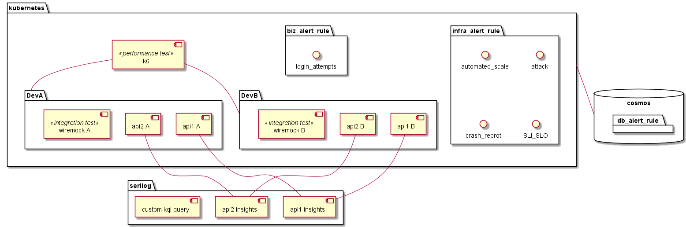

# process
    - ใช้ [software development life cycle (agile model)] ตั้งเป็นไอเดียหลัก
    - เติมรายละเอียด [TheS process] ที่เคยคุยกันมา
    - แทรก sre practices

- planning
- analysis
    - requirements & concepts
- design >> [sre6] Development
    - ui wireframe & demo
    - ui design & demo
    - design interfaces & apis & components
    - scenarios
        - design [sre1] Mornitoring
            metric
            log data
        - design [sre2] Incident Response
            alert rule
            policy/setting
- implementation >> [sre6] Development
    - pilot technique
    - implements
    - [sre4] Testing
        - unit tests
        - integretion tests
        - system testing
        - acceptance testing
        - automate testing
    - errors
        - [sre1] Mornitoring
        - [sre2] Incident Response
        - [sre3] Postmortem and Root-Cause Analysis
            - diagnostic
- testing & integration >> [sre5] Capacity Planning
    - security test
    - performance test
    - [sre1] Mornitoring
    - [sre2] Incident Response
- maintenance >> [sre7] Product
    - [sre1] Mornitoring
    - [sre2] Incident Response
    - [sre3] Postmortem and Root-Cause Analysis

------------------------------------------

# ปัญหา
- serilog ดูยาก > pilot ใช้ kql ได้ไหม ที่ไหน
- kube insight > stop/start แล้ว log หาย
- ยังไม่ตกลงรูปแบบการทำ interface เลยไม่ค่อยทำ unit test
- ไม่ได้ทำ integretion tests ++
    - automaetd integration test
- apply alert rule + serilog ?
- api กองอยู่ที่เดียว
- bridge ค้าง

# Tasks
- ลอง bridge ค้าง
    >> chok + cap
- kube logs & alert / stop/start cluster
    >> chok + cap
- ลอง app insight
    - app service
    - kube
- ลองเอา serilog ออก ใช้ app insight แทน ทำที่ facing
    >> chok + cap
    >> need earn
- design api project
    >> ae ake to
- testable interface structure
    >> ae ake to

------------------------------------------

# try design

------------------------------------------

# 1 Mornitoring
- tools
    - application insights
    - application map
    - serilog
    - kql
    - alet rule
    - azure Monitor logs (kql)
    - metrics
- design
    - SLO/SLI
    - alet rule

# 2 Incident Response

# 3 Postmortem and Root-Cause Analysis
- inner source

# 4 Testing
- unit test
- wiremock

# 5 Capacity Planning
- k6

# 6 Development

# 7 Product