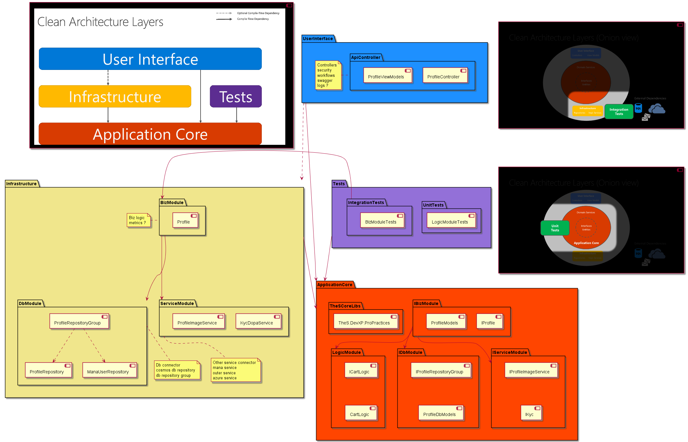

# process

- 1 Mornitoring
  - app insight
    - snapshot debugger ✅
    - trace ⏳
- 2 Incident Response
  - IT audit process ⏳
    - ฯ
  - alert rule
    - เงื่อนไขไรบ้าง 🙋‍♂️
    - ส่งเมล์ azure AD, role, forward >> pilot 🙋‍♂️
    - web hook >> pilot 🙋‍♂️
    - telegram >> pilot ? 🙋‍♂️
    - สร้าง issue >> pilot 🙋‍♂️
    - hot fixed process 🙋‍♂️
    - smart
  - kubernetes scale
  - mana backoffice
- 3 Postmortem and Root-Cause Analysis
  - board issue ทำไรต่อ ตาม inner source process 🙋‍♂️
- 4 Testing
  - unit test
  - integretion test
    - wiremock
      - doc 🙋‍♂️
      - apply to mana 🙋‍♂️
- 5 Capacity Planning
  - load test K6
    - doc 🙋‍♂️
    - apply to mana 🙋‍♂️
- 6 Development
  - testable & scalable structure 
    - interfaces design ⏳
    - components & services design ⏳
- 7 Product

## Design

- ของที่จะต้องทำ
    - testable & scalable structure
        - interfaces design
        - components & services design

    
    

    - SLI/SLO
        - availability >> สมมติ >99%
        - response time >> สมมติ <300ms
        - ฯ
    - alet rule
        - failures
            - error budget
            - เคสผิดปกติ
        - performance monitor
            - scale

- dev phase
    - ทำ automate tests
        - unit tests
        - integretion tests
    - failures >> debug
        - local >> normal debug
        - online dev environment
            - application insights
                - Failures
                - End-to-end transaction details
                - Live metrics
            - App services Attach debugger
            - Bridge to kubernetes
    - performance monitor
        - response time
            - optimize code
    - design resolve issue protocal
        - mana back office

- release phase
    - failures
        - resolvable by protocal
        - ไม่ร้ายแรง >> define scope ว่าแบบไหนไม่ร้ายแรง
            >> สร้าง board issue รอ fix release ถัดไป
        - critical >> define scope ว่าแบบไหน critical
            >> สร้าง board issue > hot fixed
        - unknowned issue >> คุยตัดสินใจว่าเข้า 3 เคสไหนข้างบน
    - performance monitor
        - scale

## Structure
- tools
    - application insights
        - Failures
            >> ใช้ดูว่ามี error ตอนเรียก api มั้ย
        - End-to-end transaction details
            >> ใช้ดูว่าใน Failures แต่ละ operation เกิด error ที่จุดไหนในระบบ
        - Live metrics
            >> monitor request ตอน test online ว่ามี error
        - Performance
            >> monitor overall request/response ถ้าช้าไปก็ควร optimize
        - Alerts
            >> 
        - Metrics
            >> build in metric: cpu, ram, response time
                scale
                mail to operator
            >> custom metric สำหรับ biz alert เช่น
                login fail เกิน 5 ครั้ง เมล์แจ้ง operator
                login fail เกิน 10 ครั้ง hook ล็อก  account 1 hr.
        - Logs
    - App services Attach debugger
    - Bridge to kubernetes
    - k6
    - wiremock
        >> test mock dopa server
    - automate unit test
    - snapshot debuger

## develop a new feature
- ใช้ [software development life cycle (agile model)] ตั้งเป็นไอเดียหลัก
- เติมรายละเอียด [TheS process] ที่เคยคุยกันมา
- แทรก sre practices

- planning
- analysis
    - requirements & concepts
- design >> [sre6] Development
    - ui wireframe & demo
    - ui design & demo
    - design interfaces & apis & components
    - scenarios
        - design [sre1] Mornitoring
            metric
            log data
        - design [sre2] Incident Response
            alert rule
            policy/setting
- implementation >> [sre6] Development
    - pilot technique
    - implements
    - [sre4] Testing
        - unit tests
        - integretion tests
        - system testing
        - acceptance testing
        - automate testing
    - errors
        - [sre1] Mornitoring
        - [sre2] Incident Response
        - [sre3] Postmortem and Root-Cause Analysis
            - diagnostic
- testing & integration >> [sre5] Capacity Planning
    - security test
    - performance test
    - [sre1] Mornitoring
    - [sre2] Incident Response
- maintenance >> [sre7] Product
    - [sre1] Mornitoring
    - [sre2] Incident Response
    - [sre3] Postmortem and Root-Cause Analysis

--------
    pull request
        -> implementation
        -> testing & integration
    contribute issue/bug -> testing & integration
    single environment -> implementation

------------------------------------------

# 1 Mornitoring
- tools
    - application insights
    - application map
    - serilog
    - kql
    - alet rule
    - azure Monitor logs (kql)
    - metrics

# 2 Incident Response
- design
    - SLO/SLI
    - alet rule
- inner source

# 3 Postmortem and Root-Cause Analysis

# 4 Testing
- unit test
- wiremock

# 5 Capacity Planning
- k6

# 6 Development

# 7 Product

------------------------------------------

# ปัญหา
- serilog ดูยาก > pilot ใช้ kql ได้ไหม ที่ไหน
- kube insight > stop/start แล้ว log หาย
- ยังไม่ตกลงรูปแบบการทำ interface เลยไม่ค่อยทำ unit test
- ไม่ได้ทำ integretion tests ++
    - automaetd integration test
- apply alert rule + serilog ?
- api กองอยู่ที่เดียว
- bridge ค้าง

- ไม่ได้เช็คสิทธิตอน call api เช่นเจ้าของร้าน

- security / bypass
- least privilege
- zero trust / zero touch
- Clean Architecture

# Tasks
- ลอง bridge ค้าง
    >> cap
- kube logs & alert / stop/start cluster
    >> chok
- ลอง app insight
    >> chok
    - app service
    - kube
- ลองเอา serilog ออก ใช้ app insight แทน ทำที่ facing
    >> chok + cap
    >> need earn
- wiremock(dopa) + prove
    >> ae 2 days
- design api project + sre
    >> ae ake to
- interface structure ที่ test ได้ + sre
    >> ae ake to
- ลองย้ายตาม design ใหม่ apply SRE
    >> ae ake to
- apim
    >> automation

    - api description
    - gen swagger
    - import api

------------------------------------------

# try design

