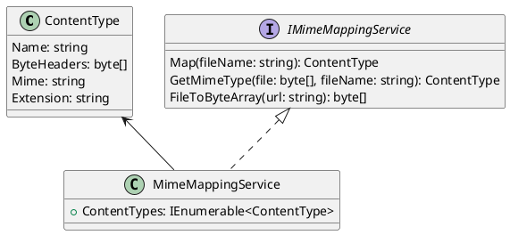

# Content type
- class diagram

```plantuml
@startuml Content type

class ContentType {
    Name: string
    ByteHeaders: byte[]
    Mime: string
    Extension: string
}

interface IMimeMappingService {
    Map(fileName: string): ContentType
    GetMimeType(file: byte[], fileName: string): ContentType
    FileToByteArray(url: string): byte[]
}

class MimeMappingService implements IMimeMappingService {
    + ContentTypes: IEnumerable<ContentType>
}
ContentType <-d- MimeMappingService

@enduml
```

- sorting
    - TXT = { 0 };
    - TXT_UTF32_BE = { 0, 0, 254, 255 };