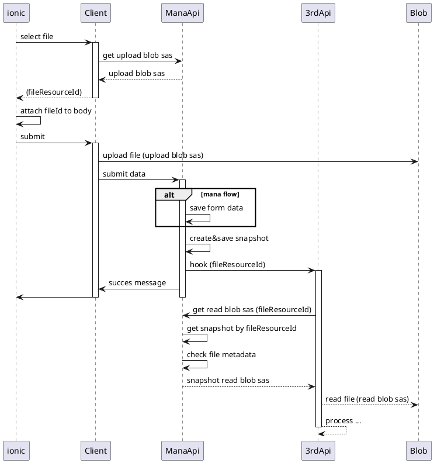

# เช็คความถูกต้องไฟล์ว่าโดนเปลี่ยนหลังจาก Submit มั้ย
- ~~client hash file content ส่งมาตอน submit ด้วย save ลง db~~
    - ~~client เป็นจุดที่ hash จะทำให้ช้าขึ้นรึเปล่า ?~~
    - ~~ต้องมี db เอาไว้บันทึก hash~~
- ~~gen sas ตั้งชื่อตาม fileId แล้วตอน submit เสร็จให้ revoke sas นั้น~~
    - ~~limit จำนวน sas ?~~
- ~~duplicate file ตอน submit~~
    - ~~เปลืองเนื้อที่~~
- snapshot

# เช็ค metadata file ว่าถูก format และ mana อนุญาตมั้ย
- เช็คตอนขอ read sas ส่ง flag ไปว่า read ได้มั้ย
- ~~เช็คตอนจะอ่าน content file นั้น (ถ้าต้องอ่านผ่าน apim)~~

# Blob Lifetime
- / new storage account
    - / blob life time >> add rule
        - / delete all (base/snapshot/version) >> เลือกได้
        - / filter container
- / delete by code
    - / disable soft delete >> config ได้
    - / snapshot
        - / DeleteSnapshotsOption

# upload structure
- container >> limit 50000 containers
    - temp-upload
        - อัพโหลดชั่วคราวจาก client
        - apply Lifetime rule >> 1 วัน
        - fileResourceId
            - ~~dev/{daId}/service/{serviceId}/{mcontentId}/{endpointId}/{fileId}~~
            - {mcontentId}/{endpointId}/{fileId}
        - partner read from apim
            - dev/{daId}/service/{serviceId}/tempupload/sas/{*fileResourceId}
    - kyc
        - apply Lifetime rule >> 30 วัน
        - อัพโหลดข้อมูล kyc รอ approve
        - fileResourceId
            - {PID}_{yyyyMMddhhmmss}.json
    - file-upload
        - partner ฝากไฟล์ โดย upload ผ่าน apim
        - อาจจะ apply Lifetime rule นานๆ เช่น 365 วัน
        - fileResourceId
            - {serviceId}/{type}/{bizAccountId}/{refId}
            - dev/{daId}/service/{serviceId}/{*fileResourceId}
        - partner read from apim
            - dev/{daId}/service/{serviceId}/fileupload/sas/{*fileResourceId}
            - dev/{daId}/service/{serviceId}/fileupload/{*fileResourceId}

## snapshot

- Lifetime rule ทับกัน >> ลองเซต 1 / 3 วัน แล้ว
- แยก storage ล่างสุดยังไง ??
- ContentType > DataType รวมๆ /
- public / private
- เปิด api ไหนบ้าง
- upload to temp check security

- class diagram
- url

- accessKey >> ?ac=QkJHjGJHG&d=2021-06-29T17:13:30Z&p=w
- accessKey >> ?ac=QkJHjGJHG&d=2021-06-29T17:13:30Z&p=r
- accessKey >> ?ac=QkJHjGJHG&d=2021-06-29T17:13:30Z&p=rd
